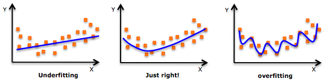

# Regularization: The Problem of Overfitting

- **Underfitting**
  - The learned hypothesis is too simple <!-- sometimes naive -->
  - High bias
- **Overfitting**
  - The learned hypothesis fit the training set _too well (cost -> 0)_
  - High variance
  - Fail to generalize to new examples
- Just right: good compromise.



## Addressing Overfitting

- **Reduce number of features**
  - Manually select features to keep
  - Model selection algorithm (later in the course...)
- **Regularization**
  - Keep all features, but reduce magnitude values of parameters

## Cost Function

$$
J(\theta) = \frac{1}{2m} \left[ \sum^m_{i = 1} (h_\theta(x^{(i)}) - y^{(i)})^2 + \lambda \sum^n_{j = 1} \theta_j^2 \right]
$$

In regularized linear regression, we choose to minimize $J(\theta)$.

## Regularized Linear Regression

```
repeat {
  theta(1) := theta(1) - alpha * (1 / m) * sum(h(x(i)) - y(i)) * x0(i)
  theta(j) := theta(j) - alpha * (1 / m) * sum(h(x(i)) - y(i)) * xj(i) % j = 0, 1, 2, ..., n
}
```

Or,

```
theta(j) := theta(j) * (1 - alpha * (lambda / m)) - alpha * (1 / m) * sum(h(x(i)) - y(i)) * xj(i)
```

## Normal Equation

...
