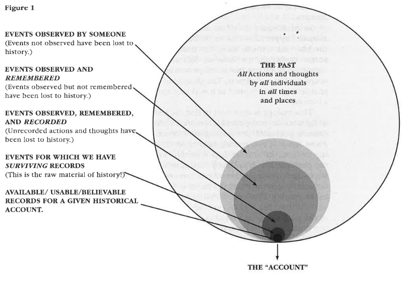

# What is History?

- General definition
  - _Human history_
  - History encompasses all **actions and thoughts** by all individuals in all times and places on this planet.
  - History is the sum of total of everything that has actually happened in the past.

