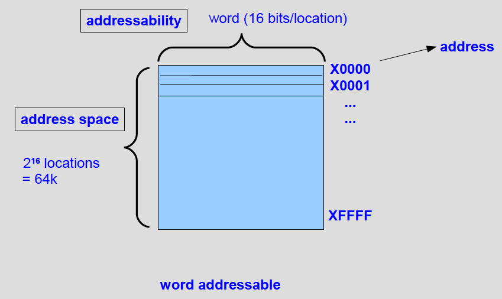
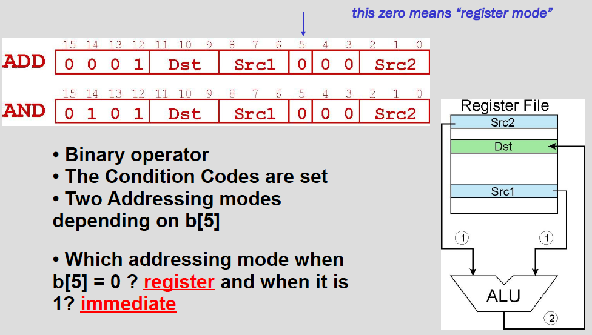
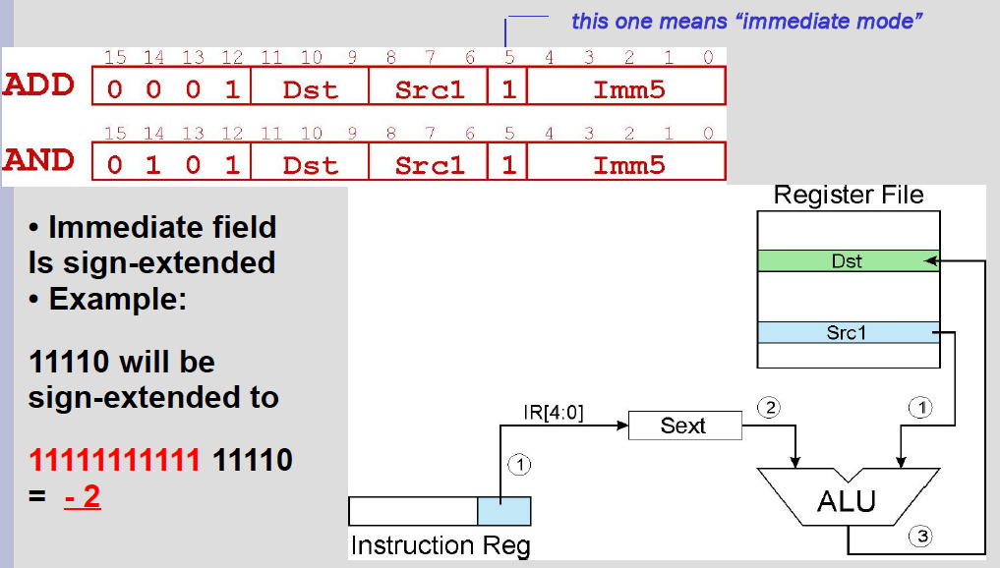
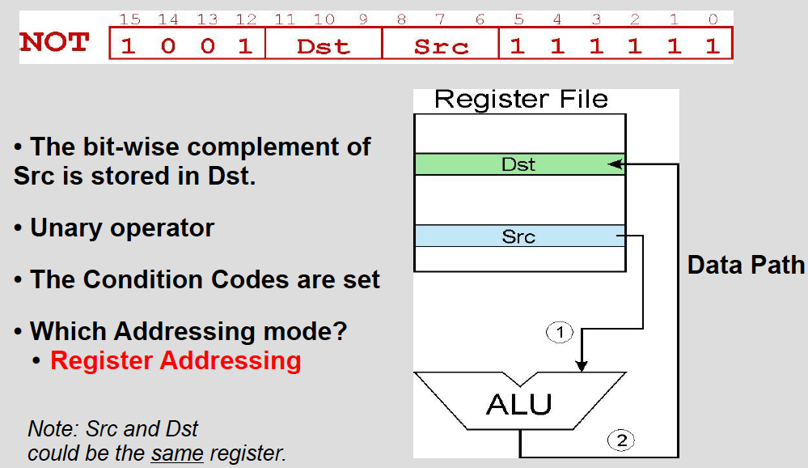

# The LC-3 ISA

The ISA specifies all the information about the computer that the software has to know.

- Memory
  - Address space (how many locations?)
  - Addressability (word or byte, word size)
- Registers
  - Number (how many?)
  - Type
- Instructions
  - Operations
  - Data types
  - Addressing modes

## Memory Organization

## Data Types

2's Complement

## Registers

- **8 GPRs (General Purpose Registers)**: R0 - R7, each 16 bits
- **MAR, MDR**
- **PC, IR**
- Condition Codes: **P, Z, N**
- **KBDR, KBSR** (KeyBoard), **DDR, DSR** (Display)

### Condition Codes

- 3 single bit **registers** (set to 1 or cleared to 0)
  - **N**: when value written was **negative**
  - **Z**: when value written was **zero**
  - **P**: when value written was **positive**
- Affected each time any register is written
- Condition codes are read by conditional branch instructions

## Addressing Modes

- **Immediate** (in the insn itself)
- In a **Register**
- In **Memory**
  - **PC-Relative**: Addr = PC + Offset
    - Aka. **Indirect Mode**
    - Specify address directly in the instruction
      - **Limited to approx. 256 locations of offset**
    - Used: _LD, ST_
  - **Base + Offset**: Addr = BaseReg + Offset
    - Use a register to generate a full 16-bit address
  - **Indirect**: _Address of a location contains the address of the operand_
    - An address is formed the same way as with LD / ST.
      - This address contains **the address of the operand** (_address of the address of the operand_)
    - Memory has to be accessed twice in order to get the address of the operand

## Instructions

- 3 Operate Instructions:
  - **ADD** (0001)
  - **AND** (0101)
  - **NOT** (1001)
- 7 Data Movement Instructions:
  - **LD** (0010)
  - **LDI** (1010)
  - **LDR** (0110)
  - **LEA** (1110)
  - **ST** (0011)
  - **STI** (1011)
  - **STR** (0111)
- 5 Control Instructions
  - **BR** (0000)
  - **JMP / RET** (1100)
  - **JSR / JSSR** (0100)
  - **RTI** (1000)
  - **TRAP** (1111)

### ADD / AND

#### Register Mode

- **Bit 5 = 0**
- Reg_Dst = Reg_Src1 + Reg_Src2

#### Immediate Mode

- **Bit 5 = 1**
- Reg_Dst = Reg_Src1 + **Imm5**

### NOT

### LD / ST

> SEXT = Sign Extended

| LD       | Dst | IR        |
| -------- | --- | --------- |
| **0010** | 010 | 010001000 |

| ST       | Src | IR        |
| -------- | --- | --------- |
| **0011** | 010 | 010001000 |

- Source / Destination in the memory:
  - Effective address = **PC** + SEXT(**IR**)
  - _Operand location must be within approximately **256** locations of the instruction_

### LDR / STR

| LDR       | DR  | BaseR | Offset |
| --------- | --- | ----- | ------ |
| **0110**  | 010 | 110   | 001000 |

| STR       | SR  | BaseR | Offset |
| --------- | --- | ----- | ------ |
| **0111**  | 010 | 110   | 001000 |

- Effective address = **BaseR** + **Offset**

### LDI / STI

| LDI      | DR  | IR        |
| -------- | --- | --------- |
| **1010** | 010 | 010001000 |

| STI      | SR  | IR        |
| -------- | --- | --------- |
| **0011** | 010 | 010001000 |

**DR / SR** = _Address of operand_

- Pointer address = **PC** + SEXT(IR)
- Effective address = \*(**PC** + SEXT(IR))

### LEA

| LEA      | Dst | Imm       |
| -------- | --- | --------- |
| **1110** | 101 | 010001000 |

- **Load Effective Address**
- Operand is obtained immediately, **without accessing the memory**

### BR

| BR       | N | Z | P | Offset    |
| -------- | - | - | - | --------- |
| **0000** | 0 | 0 | 0 | 010001000 |

- When condition is satisfied, **PC** = **PC** + Offset
- If not, **PC** remains unchanged

### JMP / RET

| JMP      |     | BaseR |        |
| -------- | --- | ----- | ------ |
| **1100** | 000 | 000   | 000000 |

- **PC** = **BaseR**

| RET      |     | ~~BaseR~~ |        |
| -------- | --- | --------- | ------ |
| **1100** | 000 | 111       | 000000 |

- _JMP R7_
- **PC** = **R7**

### TRAP

**Invoke a system routine**

| TRAP     |      | TrapVect8 |
| -------- | ---- | --------- |
| **1111** | 0000 | 10001000  |

- **Trap Vectors:**
  - **x20**: read a single character (no echo) (**GETC**)
  - **x21**: Output a character to the monitor (**OUT**)
  - **x22**: write a string to the console (**PUTS**)
  - **x23**: ~~Input a character from the keyboard~~
    print prompt to console, read and echo character from keyboard (**IN**)
  - **x25**: halt the program (**HALT**)
