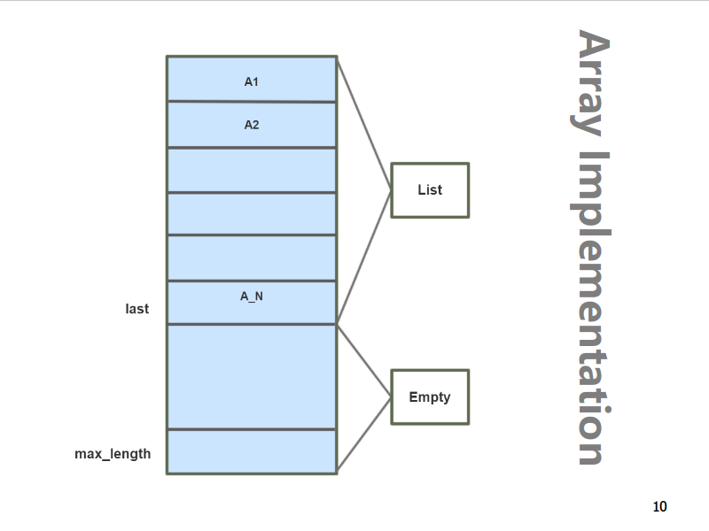

# Lecture 2: Linked Lists

## The List ADT

### Data

A _sequence_ of zero or more elements:

- _N_: Length of the list
  - if _N = 0_ then the list is empty
- **Linearly ordered**

### Operations

- `makeEmpty`
- `insert`
- `remove`
- `find`
- `findKth`
- `printList` <!-- ??? Why is this s**t needed -->

### Implementation

#### Array-Based

#### Pointer-Based <!-- ??? -->

