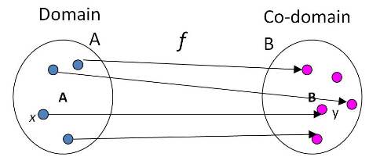
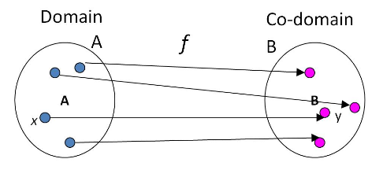

# Sets, Functions, Sequences and Summations

## Set

- A set is a collection of objects
- Set is used to group objects together

### Notation

```
{}
```

There are 3 ways to express members in the set:

1. **List all members**
  - e.g. `C = {Green, Yellow, Red}`
2. **Use predicates**
  - e.g. `E = {x | x mod 2 = 0}`
3. **Use suspension points**
  - e.g. `S = {..., -3, -2, -1}`

### Universal Sets (泛集)

- **R**: all real numbers
- **N**: all natural numbers
- **Z**: integers
- **Z+**: all positive integers

### Subset

- `S1 = S2` iff `S1 \subseteq S2 \wedge S2 \subseteq S1`
- Proper subsets
  - `S1 \subset S2` iff `\forall x [x \in S1 \rightarrow x \in S2] \wedge (S1 \neq S2)`
- Empty sets
  - `\varnothing`

### Cardinality (基数)

- **Cardinality** is **the number of distinct elements** in a set.
  - Denoted as `|S|`
- Cardinality can be either **finite** or **infinite**

### Power Sets

- The **power set** of `S` is the set of **all the subsets of S**
  - Denoted as `P(S) = {A | A \subseteq S}`

**Theorem: If `|S| = n`, then `|P(S)| = 2^n`.**

### Ordered N-Tuple

`(a1, a2, ..., an)` / `<a1, a2, ..., an>`

- Elements are **ordered**
  - `(2, 3)` and `(3, 2)` are different

### Cartesian Product

`S1 X S2 = {(a, b) | a in S1 && b in S2}` (`X = \times`)

e.g.

```
S1 = {1, 2}
S2 = {a, b, c}
S1 X S2 = {(1, a), (1, b), (1, c), (2, a), (2, b), (2, c)}
```

- If `|S1| = m`, `|S2| = n`, then `|S1 X S2| = m * n`
- **NOT communtative** (tuples)
- **NOT associative** (tuples in tuples)

### Disjoint Sets

- If `S1 \cap S2 = \varnothing`, then S1 and S2 are **disjoint**
- If `S1 \cap S2 \neq \varnothing`, then S1 and S2 are **overlapped**

## Function

A **function** `f` from `A` to `B` is a subset of `A X B` such that:

- For **all** elements in A,
- **one and only one** `y` in `B` for each `x` in `A`.

If `y = f(x)`, then

- `y` is called the **image** of `x` under `f`
- `x` is called a **pre-image** of `y`
- The set of _all images_ of `x` in the domain under `f` is called **range** of `f`
  - `f(A) = {f(x) | x in A}`

### One-To-One Function

`f` is **one-to-one** _iff_:

- for `a, b in A`, if `a neq b`, then `f(a) neq f(b)`
- aka **injective function (单射)**



### Onto Function

`f` is **onto** _iff_:

- for all `y in B`, exists `x in A` such that `f(x) = y`
- aka **surjective function (满射)**



### One-To-One And Onto Function

`f` is **bijective (双射)** _iff_:

- `f` is both **one-to-one** and **onto**

### Inverse Function

- Inverse functions are only applicable to _bijections_.
- If `f` is a _bijection_ from `A` to `B`, then `f^{-1}` is **from `B` to `A`**.

## Sequences and Summations

- **Sequences** are **ordered lists** of elements.
- **Summation** is the value of the sum of the terms of a sequence

TODO
