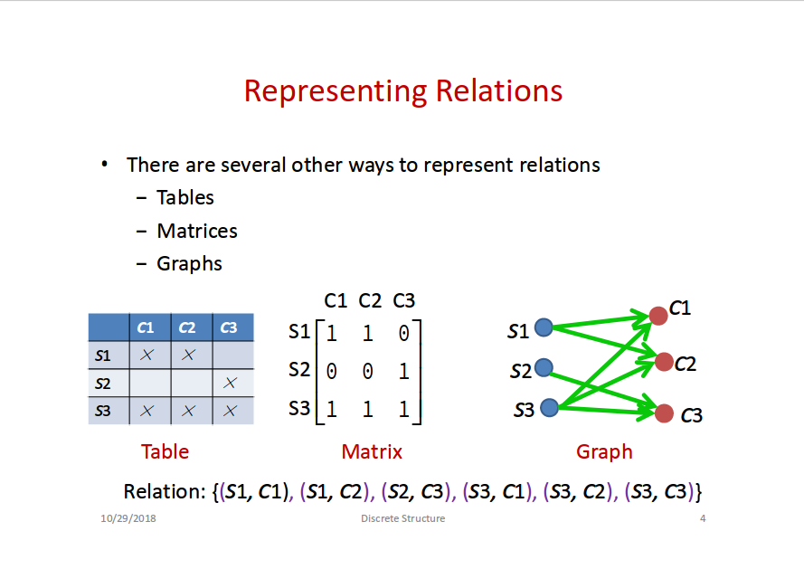

# Lecture 10: Relations

## Representing Relations

- Tables
- Matrices
- Graphs

## Binary Relations

- A binary relation from set `A` to set `B` is **a subset of `A X B`** (`X = \times`)
- `R` is a set of **ordered pairs** in the form `(a, b)` where `a ∈ A` and `b ∈ B`
- `a R b` (denotes `(a, b) ∈ R`) is called **`a` related to `b` by R**

## Functions and Relations

- Functions are **specialization (特化)** of relations
- Relations are **generalization (泛化)** of functions

## Properties of Relations

- **Reflexive (自反)**
  - `(a, a) ∈ R` for all `a ∈ A`
- **Symmetric**
  - `(a, b) ∈ R && (b, a) ∈ R` for all `a, b ∈ A`
- **Anti-Symmetric**
  - `(a, b) ∈ R && (b, a) ∈ R -> a = b` for all `a, b ∈ A`
- **Transitive (传递)**
  - `(a, b) ∈ R && (b, c) ∈ R -> (a, c) ∈ R` for all `a, b, c ∈ A`
