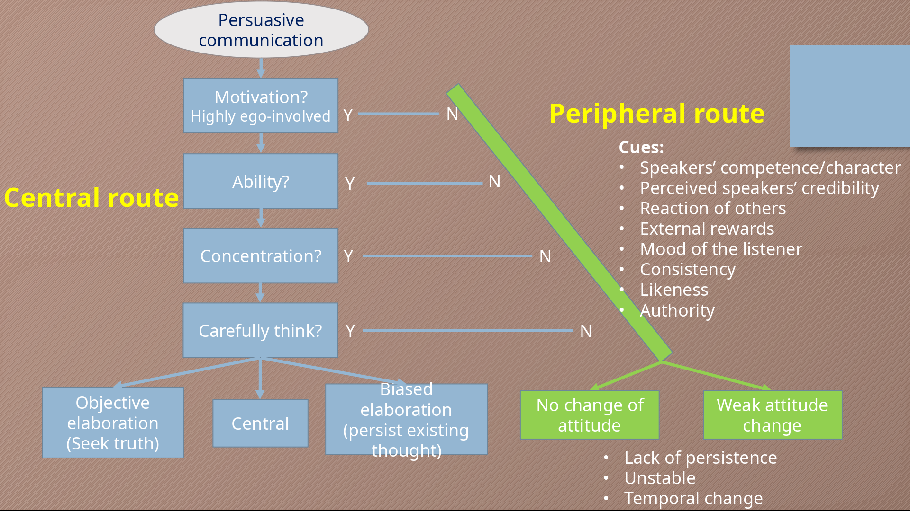

# Elaboration Likelihood Model (ELM)

> "**Dual process theory** of how attitudes are formed and changed."
>
> -- Richard Petty, John Cacioppo (~1980s)

## Two Major Routes to Persuasion

### Central Route

- **Scrutiny of Message**
  - elaboration & "think carefully"

### Peripheral Route

- **Without active thinking**
  - judgement made based on irrelevant cues
  - _e.g. authority_

## Motivation for Elaboration

> Is it worth the effort?

One can only examile a **limited number of ideas** at a time.

- More elaboration: highly ego-involved
- Less elaboration: often irrelevant to the topic

## Ability for Elaboration

> Can they do it?

- **Consideration**
  - _Biased:_ top-down thinking with only pre-existing information
  - _Objective thinking:_ buttom-up thinking with facts discovered by them
