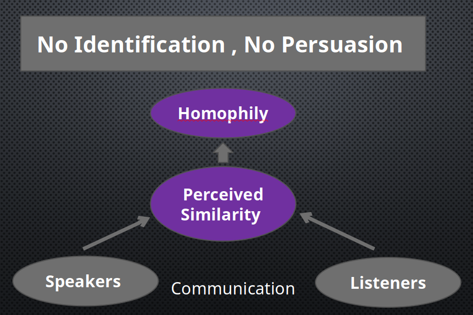

# Dramatism of Kenneth Burke

People use these perspectives from Burke to **analyse public communication:**

- Identification (认同)
- Dramatistic pentad (戏剧五要素)
- Guilt-redemption cycle (罪恶—救赎循环)

## Identification

**Recognized commons** between the speaker and the audience: _physical characteristics, talents, occupation, experiences, personality, beliefs, attitudes, ..._

- _Homophily_: **perceived similarity** between the speaker and the audience

## Dramatistic Pentad

- **Scene:** a _context_.
- **Act:** _what_ was done?
- **Agent:** _who_ did it?
- **Agency:** _how_ did they do it?
- **Purpose:** what's the _purpose_?

## Guilt-Redemption Cycle

The ultimate motivation of all public speaking: to **get rid of guilt**.

There are 2 ways to purge the sense of guilt:

1. Mortification (悔恨) - **self-blame**, request for forgiveness
2. Victimage (受害化) - **scape-goating**, ~~throwing woks~~

## Applications of the Theory

- propaganda
- advertising
- business influence on policies or agenda
