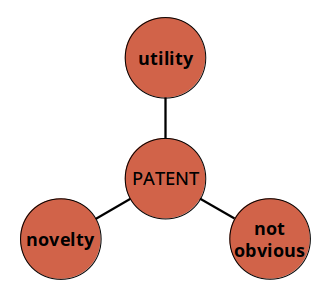

# Patent

## Key Concepts

- Invention
- Inventive step
- Novelty
- Obviousness (triviality)
- State-of-the-art
- Prior concept
- Prior user (existing user)
- Prior (common general) knowledge

## Patentability Road Map

1. Invention?
2. Novelty?
3. Trival?
4. Industrial application?
5. Patent.

## Invention and Inventive Steps

S.96: An invention involves _inventive steps_ if it is **not trival** to a person skilled in the art, having regard to any matter which forms part of the state of art.

- Invention: result of a creative idea
- Step: noticeable
- Inventive step: a clearly identifiable difference between the state of art and the claimed invention

## Proper Approach to Patent Registration

1. Take care of the **number of invention** is involved in a single registration (it should be 1 per registration)
2. Identify **alleged (faked) inventions** (that actually exist before; _trival_)
3. Identify **collocation of (combined) inventions** (that are actually a combinition of several prior inventions)
  - _SABAF SPA v. MFI Furniture Centres Ltd_
  - if the collocation of invention **_together_ produces new or improved result**, it is patentable!
