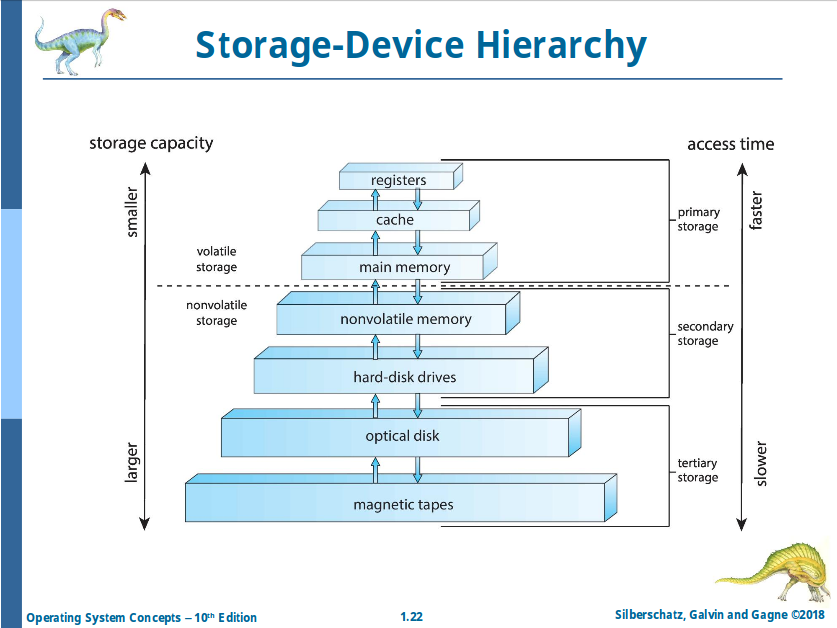

# Chapter 1: Introduction

**Controls and coordinates use of hardware among various applications and users**

## Defining OSes

No universally accepted definition:

- "Everything a vendor ships when you order an operating system"
- "The one program in memory at all times on the computer" -> **Kernel**
- Everything else is either:
  - **A system program**
  - **An application program**

## Computer System Organization

- One or more CPUs, device controllers connect through common **bus** providing access to shared memory
- Concurrent execution of CPUs and devices competing for memory cycles

## Common Functions of Interrupts

        Interrupt -> Interrupt Vector -> Interrupt Routine
                  +> ~~Polling (Obsolete)~~

- A **trap** or an **exception** is generated by software
- An operating system _kernel_ is **interrupt-driven**

## I/O Structure

- ~~`wait` instruction~~
- ~~Data -> User Program -> Kernel -> Hardware~~
- **Direct Memory Access (DMA):**

                Data
          CPU <-----> RAM
            ^           ^
        Req |           | Data
            v           |
        Device <-------+

## Storage Structure

...

## Storage Hierarchy

## Operating System Operations

1. Bootstrap
2. Kernel loads
3. System deamons start

- Kernel is _interrupt driven_
  - -> Hardware
  - -> Software
    - SIGFPE (division by 0)
    - System call
    - Strange things

## Multiprogramming and Multitasking

- Multiprogramming (_Batch System_)
- Time-sharing (_multitasking_)

## Multimode

- User mode
- Kernel mode
- (Hypervision mode)

## Process Management

**A process (_active entity_) is a program (_passive entity_) in execution.**

## File System Management

Files are abstracted (faked).

## Caching

- Make things faster
