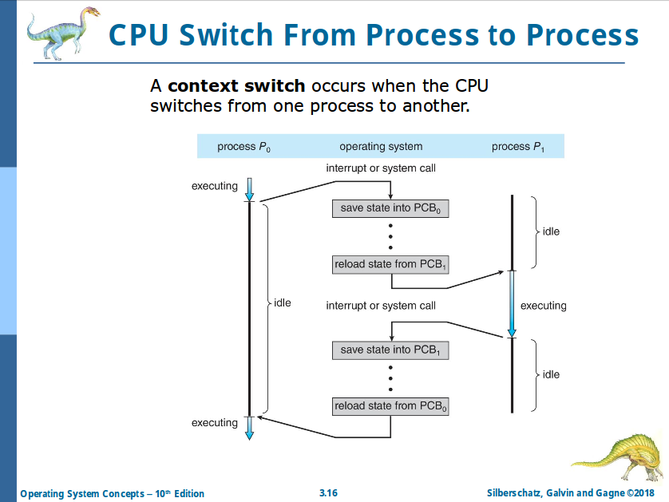

# Chapter 3: Processes

- **Process**: a program in execution
  - **Text section**: the program code
  - **Program counter**: current activity
  - **Stack**: temporary data
  - **Data section**: global variables and static variables
  - **Heap**: dynamically allocated memory

## State

- New
- Running
- Waiting
- Ready
- Terminated

## Process Control Block (PCB)

aka **task control block**: information associated with each process

- Each process in memory has a corresponding unique PCB in the kernel

## Threads

In Chapter 4!

## Process Scheduling

- **Process scheduler** selects among available processes for next execution on CPU core
  - Maintaining scheduling queues:
    - **Ready queue**
    - **Wait queues**

## Context Switch

## Process Creation

- **Parent** process creates **children** processes, forming a **tree**
- Processes are identified and managed via **process identifier (PID)**
- Resource sharing options
  1. Parent and children share all resources
  2. Children share subset of parent's resources
  3. Parent and child share no resources
- Execution options
  1. Parent and children execute concurrently
  2. Parent waits until children terminate

On UNIX:

1. `fork()` syscall creating a new process
2. `exec()` syscall replacing the process' memory space
3. `wait()` syscall for the parent to wait the children

## Process Termination

- `exit()` ask the operating system to delete it
- `abort()` for rare things
- **Cascading termination**
- If no parent is waiting and the child dies, the child process becomes a **zombie**
- If parent terminated without involking `wait`, the child process becomes an **orphan**

## Interprocess Communication

- **Shared memory**
- **Message passing**
  - **Direct communication**
    - Process must name each other explicitly
      - `send(P, msg)` / `receive(Q, msg)`
    - Links are established automatically
    - A link is associated with **exactly one pair of processes**
    - Between each pair there exists **exactly one link**
    - Bi-directional, may be unidirectional
  - **Indirect communication**
    - Messages are directed and received from _mailboxes (aka ports)_
      - Each mailbox has a unique id
      - Processes can communicate only if they share a mailbox
      - `send(A, msg)` / `receive(A, msg)`
    - Link established only if processes share a common mailbox
    - A link may be associated with **many processes**
    - Each pair of processes **may share several communication links**
    - Link may be unidirectional or bi-directional

## Synchronization

- **Blocking** is considered **synchronous**
- **Non-blocking** is considered **asynchronous**
- If both send and receive are blocking, we have a **rendezvous**

## Buffering

- Zero capacity
- Bounded capacity
- Unbounded capacity
