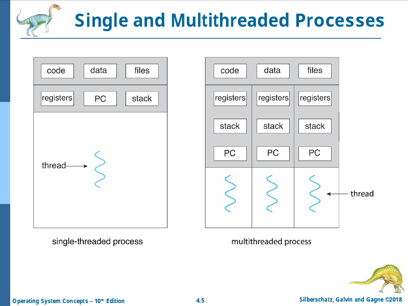
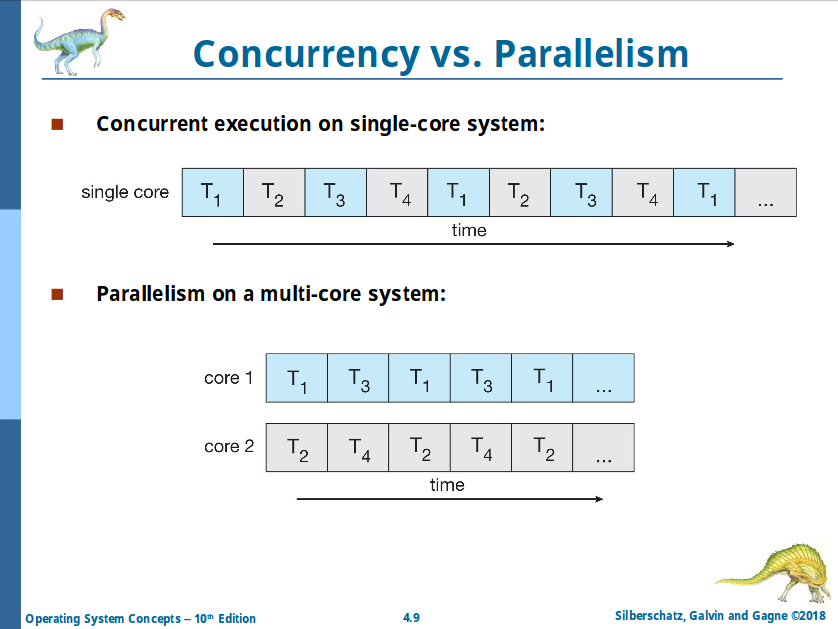

# Chapter 4: Threads & Concurrency

Process creation is heavy-weight while thread creation is light-weight.

## Benefits

- Responsiveness
- Resource sharing
- Economy
- Scalability

## Multicore Programming

- Multicore or multiprocessor systems putting pressure on programmers, challenges include:
  - Dividing activities
  - Balance
  - Data splitting
  - Data dependency
  - Testing and debugging
- **Parallelism** implies a system can perform more than one task simultaneously
- **Concurrency** supports more than one task making progress
  - Single processor / core, scheduler providing concurrency

