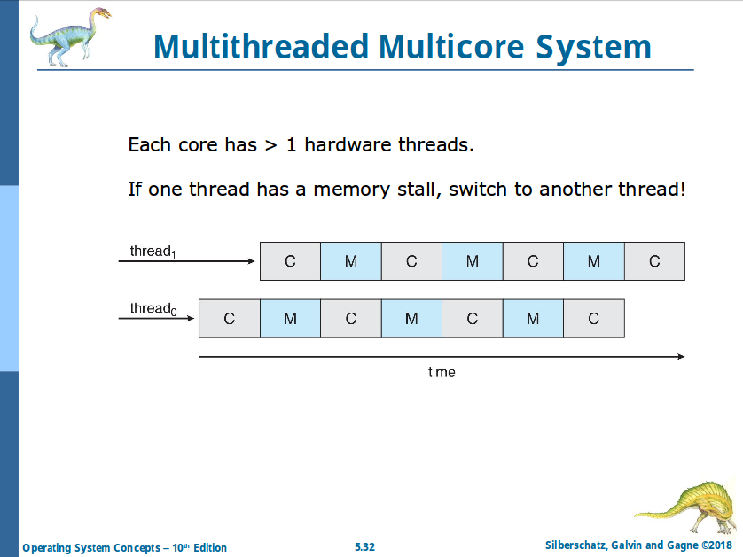

# Chapter 5: CPU Scheduling

- Scheduling decided by the process itself is **nonpreemptive**
- Scheduling decided by the hardware and kernel is **preemptive**

## Scheduling Optimization Criteria

- Max **CPU utilization**
- Max **throughtput**
- Min **turnaround time**
- Min **waiting time**
- Min **response time**

## First Come First Surved (FCFS) Scheduling

Convoy effect - short process behind long process.

## Shorter Job First (SJF) Scheduling

Add the concepts of varying arrival times and preemption to the analysis.

## Round Robin (RR) Scheduling

- Each process gets a small unit of CPU time (time quantum `q`), usually **10 - 100 milliseconds** (context switch costs <10 us).  After this time has elapsed, the process is preempted and added to the end of the ready queue.
- No process waits more than `(n - 1) q` time units
- Typically, higher average turnaround than SJF, but better response

## Priority Scheduling

- A priority number (integer) is associated with each process
- _SJF is priority scheduling_
- Problem: **Starvation** - low priority processes may never execute
  - Solution: **Aging** - as time progresses increase the priority of the process.

## Priority Scheduling with Round Robin

- Run the process with the highest priority
- Processes with the same priority run round-robin

## Multilevel Queue

- With priority scheduling, have separate queues for each priority
- Prioritization based upon process type

## Multilevel Feedback Queue

Aging processes get swapped to lower priority queues.

## Thread Scheduling

_When threads supported by kernel, threads scheduled, not processes_

## Multi-Processor Scheduling

- **Symmetric multiprocessing (SMP)** is where each processor is self scheduling
- Depends on the OS:
  - All threads may be in a common ready queue
  - Each processor may have its own private queue of threads

## Chip Multithreading (CMT)

Intel calls it **hyperthreading**.

