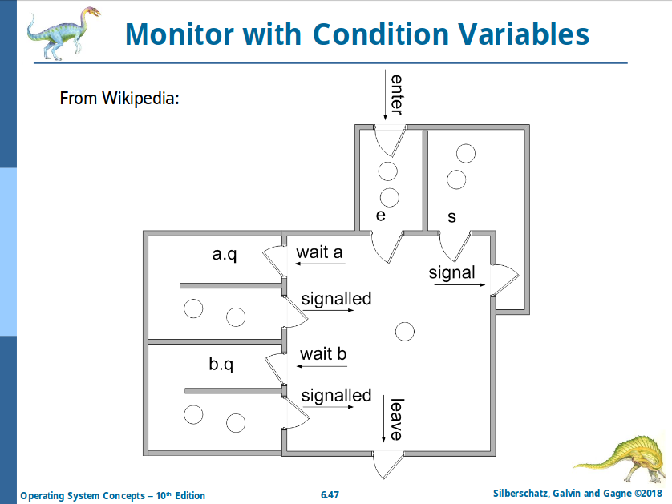
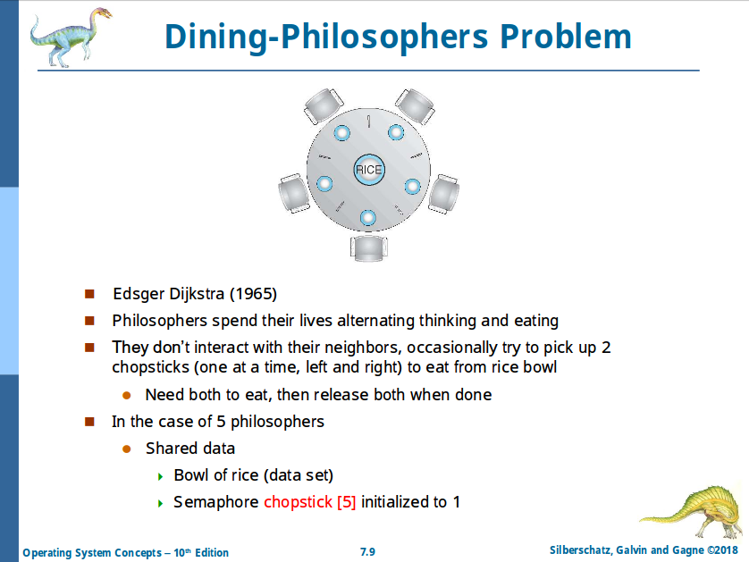

# Chapter 6: Synchoronization

## Critical Section Problem

- Designed to solve the problem _Race Condition_
  - _Thread-safe_ if it does not have race condition
- Any piece of code that must be executed by **at most one process at a time**
- Each process:
  - _Must_ ask permission to enter critical section with **entry section**
  - _May_ follow critical section with **exit section**
  - Then **remainder section** (?)

```c
do {
  // [entry section]
    // critical section
  // [exit section]
    // remainder section
} while (true)
```

Solutions:

- **Mutual Exclusion**
  - If process `i` is executing in its critical section, then **no other processes** can execute their critical sections
- **Progress**
  - Each process enter their critical sections one after one
  - Being nice to each other (?)
- **Bounded Waiting**
  - There is a bound of **1** time allowed for process `i` to enter the critical section **before process `j` is finished**
    - Because when `j` finishes, it gives the chance to `i` immediately
  - `i` is guaranteed to be able to enter the critical section _at some point in the future_ (right after `j` is finished)
  - ?

> Philippe says:
>
> Suppose you and your friend are having one bowl of rice with only one spoon.
>
> - Mutual exclusion is about when your friend is eating, _can you eat?_
> - Progress is about when your friend keeps eating, _do you have the chance to eat?_
> - Bounded waiting is about when your friend is hungry and eats a lot, _can you still eat from time to time?_

## Peterson's Solution

- **This assumes `load` and `store` instructions are _atomic_**
  - When process `i` and `j` try to give chance to each other:
    - The hardware will either `load` or `store`
- Two processes sharing 2 variables:
  - **`int turn`**: Indicate **whose turn it is** to enter the critical section
    - Provides _Mutex_
  - **`bool flag[2]`**: Indicate if a process is **ready** to enter the critical section
    - Provides _Progress_
- Even when `j` is much faster than `i`, it is impossible for `j` to beat `i`
  - Provides _Bounded Waiting_

```c
do {
  flag[i] = true;
  turn = j;
  while (flag[j] && turn == j) {}
    // critical section
  flag[i] = false;
    // remainder section
} while (true);
```

- Correct sulution!
- But not used because of the _busy waiting (while loop)_

## Synchronization Hardware

- Uniprocessor disables interrupt during critical section processing
- Multiprocessor provides special instructions (atomic ones)
  - Either _test memory_ or _set memory_ in one atomic instruction
  - Or _swap memory words_ in one atomic instruction

```c
do {
  // [acquire lock (hardware operation)]
    // critical section
  // [release lock (hardware operation)]
    // remainder section
}
```

## `test_and_set`

Definition in C (just an explanation):

```c
bool test_and_set(bool *target) {
  bool rv = *target; // old lock
  *target = true;
  return rv;         // old lock is returned
}
```

This is executed by CPU as a single instruction.

### Using `test_and_set`

```c
do {
  while (test_and_set(&lock)) {}
    // critical section
  lock = false;
    // remainder section
} while (true)
```

This algorithm provies:

- Mutal Exclusion
- Progress
- Busy-Waiting

And no Bounded Waiting.

## `compare_and_swap`

Definition in C (just an explanation):

```c
int compare_and_swap(int *value,   /* Pointer to lock */
                     int expected,
                     int new_value /* New lock value */)
{
  int temp = *value;      // old lock
  if (*value == expected) // only when the lock value is expected...
    *value = new_value;   // ...we set the lock
  return temp;            // old lock is returned
}
```

This is executed by CPU as a single instruction.

### Using `compare_and_swap`

```c
do {
  while (compare_and_swap(&lock, 0, 1) != 0) {}
    // critical section
  lock = 0;
    // remainder section
} while (true);
```

This algorithm provides:

- Mutual Exclusion
- Progress
- Busy-Waiting

And no Bounded Waiting. **NG.**

## Bounded-Waiting Mutual Exclusion With `test_and_set`

Add an array `waiting[]` storing which process wants lock.

```c
do {
  waiting[i] = true; // Process i wants a lock
  key = true;        // Key indicating whether process i should wait or not (not shared)

  // Busy-waiting for a lock
  // NOTE: waiting[i] is set to `false` by the last process!
  while (waiting[i] && key)
    key = test_and_set(&lock); // [HARDWARE] If a lock can be acquired, key == false

  // Lock is acquired
  waiting[i] = false;

  // [CRITICAL SECTION]

  // Search in the queue for the next process (j) waiting for a lock
  j = (i + 1) % n;
  while ((j != i) && !waiting[j])
    j = (j + 1) % n;

  if (j == i)
    lock = false;       // Loop goes back to starting point, no one wants a lock
  else
    waiting[j] = false; // Process i gives the lock to process j

  // [REMAINDER SECTION]
} while (true)
```

This algorithm provides:

- Mutual Exclusion
- Progress
- **Bounded Waiting**
- Busy-Waiting

> Philippe:
>
> You should try this during your lunch!
>
> Suppose you have 10 people sitting around a table with a spoon, which is the lock. If somebody wants to eat, they _raise their hand_. When you finished eating, you _search for the table for people waiting a spoon_, then you pass your spoon to the next person.
>
> Nobody starves, because everyone eventually gets the spoon.

## Mutex Locks

High-level software tool providing atomic operation, in which `test_and_set` is used.

- This solution requires _busy waiting_
  - Therefore it is called **spinlock**
- **No bounded waiting**

## Semaphore

Can be accessed via 2 atomic operations:

- `wait()` / `P()`
- `signal()` / `V()`

Semaphore `s` is an integer value.

Definition in C (just an explanation):

```c
void wait(int *s) {
  while (*s <= 0) {} // busy wait
  (*s)--;
}

void signal(int *s) {
  (*s)++;
}
```

### Usage

- **Counting Semaphore**
  - An integer value limiting how many processes can enter the critical section at the same time
  - No bounded waiting, with busy waiting
- **Binary Semaphore**
  - The same as _mutex lock_

### Semaphore Implementation With No Busy Waiting

Makes use of 2 kernel system calls:

- `block()`: place a process in scheduler waiting queue
- `wake()`: take a process from waiting queue to the CPU ready queue

Providing:

- Mutual Exclusion: `wait()` is actually `test_and_set()`
- Progress
- Bounded Waiting

No Busy-Waiting.

## Deadlock And Starvation

- **Deadlock** is 2 or more processes are waiting indefinitely for entrance of critical section
- **Starvation** is a process never being removed from the semaphore queue
- The programmer must guarantee the use of semaphores correct!

## Monitors

- An **ADT** providing convenient and efficient mechanism for process synchronization
- Only one process may be active within a monitor
  1. Shared variable(s)
    - Queues attached
  2. Constructor
  3. Procedure(s)
  4. Global queue (optional)



# Chapter 7: Synchronization Examples

## Bounded Buffer Problem

- A shared buffer that can contain `n` items / messages
- 2 Processes: a _producer_ and a _consumer_
- 3 Semaphores:
  - `full := 0`: **how many items** in the buffer
  - `empty := n`: **how many empty entries** in the buffer
  - `mutex := 1`: **lock** of buffer (necessary to prevent race condition)
  - `full + empty == n`

### Producer

```c
do {
  wait(empty);   // Wait for an empty entry (keep waiting if there's no) (empty--)
  wait(mutex);   // If there is any, lock the buffer

  // [Add an item to the buffer]

  signal(mutex); // Unlock the buffer
  signal(full);  // full++
} while (true);
```

### Consumer

```c
do {
  wait(full);    // Wait for an available item (keep waiting if there's no) (full--)
  wait(mutex);   // If there is any, lock the buffer

  // [Remove an item from the buffer]

  signal(mutex); // Unlock the buffer
  signal(empty); // empty++
} while (true);
```

## Readers-Writers Problem

- A data set shared among several concurrent processes
  - **Readers** only reads data
  - **Writers** can read and write
- Integer `read_count := 0`: number of currently reading readers
- Semaphores:
  - `rw_mutex := 1`: number of allowed writers
  - `mutex := 1`: protect `read_count`
    - _Only 1 reader can change `read_count` at a time!_

### Writer

```c
do {
  wait(rw_mutex);   // Waits until no reader is reading

  // [Write data]

  signal(rw_mutex); // Release the lock
} while (true);
```

### Reader

TODO

## Dining-Philosophers Problem



- If all philosophers pick up one chopstick at the same time, all of them will wait for the second one forever
  - Deadlock!
- No deadlock is possible, but starvation is possible
  - A complex solution is required to solve this!

TODO
