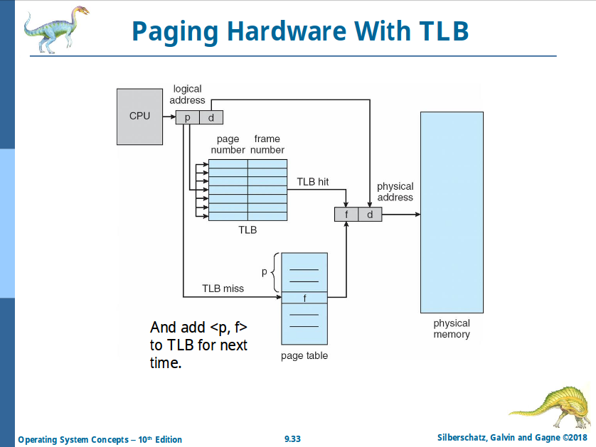

# Chapter 9: Main Memory

## Logical vs. Physical Address Space

- **Logical address**: generated by the CPU, aka **virtual address**
- **Physical address**: seen by the memory unit
- Translation done by **MMU (Memory Management Unit)** in realtime (runtime)

### Memory Management Unit

#### Simple Scheme

- **Relocation register**: the _base register_
- Logical address + relocation register = physical address

#### Variable Partition

- **Hole** is a block of available memory

To satisfy a request of size `n` from a list of holes, there are 3 schema:

- **First-Fit**: Allocate the **first** hole that is big enough
- **Best-Fit**: **smallest**, must search for entire list of hole
- **Worst-Fit**: **largest**, must search for entire list of hole (NG)

## Fragmentation

- **External**: non-continuous large-enough available memory
- **Internal**: allocated memory that is not used (larger than requested)

First fit analysis reveals that, **given `N` blocks allocated, `0.5 N` blocks lost because of fragmentation** (that is, `1 / 3` memory may be unusable (aka **50% rule**))

To reduce:

- **Compaction**: move memory to get a larger block of available memory
  - Very slow. NG.

## Paging

- **Page** is a block of _virtual memory_, _transparent (invisible)_ to the process
- **Frame** is a block of _physical memory_
- Pages and frames have the same size; they are _mapped non-contiguously_
- A **page table** is used to translate between them
- There are still internal fragmentation

Logical address generated is divided into:

- **Page Number (p)**: index into a page table, which contains **base address of each page** in physical memory
- **Page Offset (d)**: **combined with the base address** to define the physical memory address

| Page Number | Page Offset |
| :---------: | :---------: |
|     `p`     |     `d`     |
|   `m - n`   |     `n`     |

### Implementation of Page Table

- **Page Table Base Register (PTBR)** inside MMU
- **Page Table Length Register (PTLR)** inside MMU

Each memory access requires 2 memory access:

1. Page table
2. Actual data / insn

This is slow. We address this problem with...

#### Translation Look-Aside Buffer (TLB)

... aka **Associative Memory**, which is inside MMU.

- Some TLBs store **Address-Space Identifiers (ASID)** in each TLB entry
  - Practically this is _PID_
- TLB is typically small
- On TLB miss (not found), value is loaded into TLB for faster access next time
- Some entries can be **wired down** (keep permanent)



##### Effective Access Time

```
EAT = <Hit Ratio> x <Time to access memory> + <Miss Ratio> x <Time to access memory twice>
```

#### Memory Protection

- **Valid-Invalid Bit** is associated to each entry of the page table

### Structure of Page Table

- **Hierarchical Page Table**
  - Split virtual address into multiple parts
  - Use multiple level page tables
