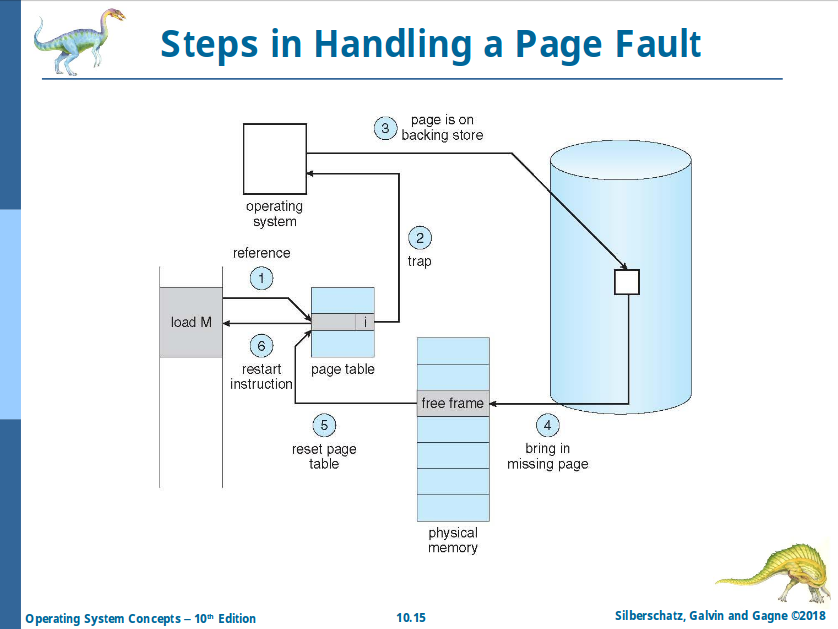

# Chapter 10: Virtual Memory

## Demand Paging

- **Lazy swapper**
  - by pager

## Valid-Invalid Bit

- `v`: In memory
- `i`: Not in memory
  - Accessing such page causes **page fault**

## Page Fault

## Performance of Demand Paging

**Effect Access Time (EAT)**:

    EAT = (1 - p) x <Memory access time>
          + p x <Page fault overhead>
          + <Swap page out>
          + <Swap page in>

Example on slide 10.19.

## Page Replacement

- **Modify (dirty) bit** is used to reduce overhead of page transfers
  - If page in RAM is different from the page in swapping space, set dirty bit to 1
- If there is no enough frame,
  - If dirty bit is set on a page, write it back, then free it
  - If dirty bit is not set on a page, directly reuse it
