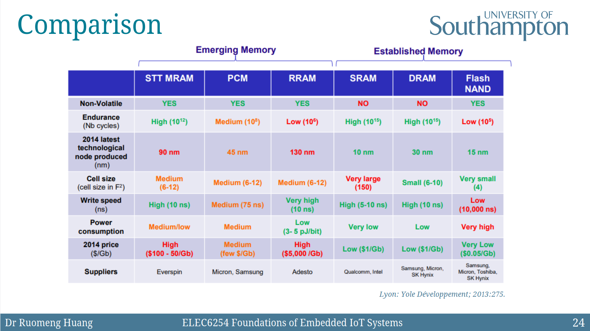

# Embedded Systems vs. General Systems

- Embedded systems:
  - have fewer application known at design
  - not programmable by the end user
  - fixed run-time requirements
- General-purpose computing systems:
  - have a broad class of application
  - programmable by the end user
  - the faster, the better

# Memory

## SRAM

- Consists of 4 + 2 MOSFETs, 2 inverters from a latch
- A single bit is stored in a bi-stable circuit
- Read / write by driving word / bit lines

### Properties

- **Capacity:** _very poor_ (6 transistors per bit (140 F^2))
- **Speed:** very fast (\< 1 ns)
- **Retention:** volatile
- **Endurance:** very long (10^16 cycles)
- **Cost:** high
- **Power:** low (0.00005pJ per bit)

## DRAM

- Consists of 1 transistor and 1 capacitor
- A single bit is stored in the capacitor
- Bit loses charge when read, drains over time
- Refresh interval is in tens of microseconds

### Properties

- **Capacity:** _extremely_ high (6 - 12 F^2)
- **Speed:** fast, but slower than SRAM (10 ns)
- **Retention:** volatile
- **Endurance:** very long (10^16 cycles)
- **Cost:** very low
- **Power:** low (0.05pJ per bit)

## EEPROM and Flash Memory

> EEPROM: Electronically Erasable Programmable Read Only Memory; flash memory is one type of EEPROM.

- Floating-gate MOSFET
  - Current flows from D (drain) to S (source) via the inversion layer
  - Charge at FG (floating gate) disrupts / affects the inversion layer
- NAND
  - small cell size, high density, low power, good endurance
  - is often used as mass storage
- NOR
  - large cell current, fast random access
  - is often used as cold storage

### Properties

- **Capacity:** high (1 - 4 F^2 for NAND)
- **Speed:** slow (100 us)
- **Retention:** non-volatile (years)
- **Endurance:** long (10^4 cycles)
- **Cost:** very low
- **Power:** very low (0.0005pJ per bit)

## NVRAMs

Refer to the slides too.

### Ferroelectric RAM

> 铁电存储器

#### Advantages

- **very low power usage** (no leakage)
- fast write performance
- high endurance (10^14 cycles)

#### Disadvantages

- **low storage density**
- high cost
- destructive read (can be compensate by fast writes)

### Magnetic RAM

> 磁性存储器

#### Pros and Cons

- fast write performance (3 - 20 ns)
- high endurance (10^14 cycles)
- low power consumption (compared to DRAM)
  - not as low as Ferroelectric RAM
- _half-select problem_

### Phase Change RAM

> 相变存储器

Based on the unique behaviror of _chalcogenide glasses_ (Ge2Sb2Te5).

#### Pros and Cons

- fast write performance (20 ns)
- good endurance (10^12 cycles)
- sensitive to temparature

### Resistive RAM

> 可变电阻式存储器

_Switching mechanism is not fully understood; hot research topic._

#### Pros and Cons

- fast switching speed (< 50 ns)
- extremely high scalability (in theory)
- poor reliability
