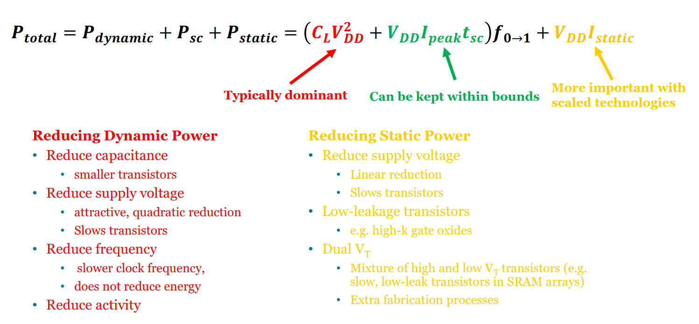

# Power and Energy

Power is considered as the most important constraint in embedded systems.

- Computing subsystem consumes power
- Communication subsystem consumes power

## Energy Storage

### Metric (C-Rating)

_**C**: ampere-hour_

- Rate of discharge (without significantly affecting supply voltage) of a battery
- _1**C**_ is a _1000**mAh**_ battery providing _1000**mA**_ for _1**h**_
  - _0.5**C**_ could be a _1000**mAh**_ battery providing _500**mA**_ for _2**h**_

### Li-ion Batteries

- Lightweight
- Explosive and costly

### Supercapacitor

- **Increased area** compared with conventional capacitors
- **No chemical reaction** involved compared with batteries
- Can provide high peak power
- Pros:
  - high density, high efficiency (97% - 98%)
  - more charge-discharge cycle
  - environmental friendly

## Dynamic Power Management

1. Dynamic operation modes
2. Dynamic voltage / frequency scaling
3. Energy harvesting

### Dynamic Operation Modes

Configure the MCU to operate at different power modes:

- Run
- Idle
- Sleep
- ...

## Power Consumption in CMOS

Refer to the slide P24 - P26.

- **Dynamic power consumption**: energy consumed when capacitors are charged (logic levels are switched)
- **Static power consumption**: energy consumed in the absence of clock signals
  - this is often the leakage current:
    - **$I_{sub}$: sub-threshold leakage**
    - $I_G$: gate tunnelling through thin oxide
    - $I_D$: reverse biased P/N junction current
    - $I_{GIDL}$: gate induced drain leakage due to tunnelling at gate-drain overlap
    - $I_{PT}$: punch through due to short channel and high drain-source voltage
- **Short circuit power consumption**: when nMOS and pMOS are both on (for a small amount of time)

## Power-Delay Product

($PDP$) Refer to the slide P27.

- Trade-off: reducing `Vdd` increases the delay.
- The slowest circuit in the core determines the frequency of operation of the core

## Energy-Delay Product

($EDP$ / $ED^2P$) Refer to the slide P28.

## Reducing Power

$$
P_{total} = P_{dynamic} + P_{sc} + P_{static} =
  \( C_L V^2_{DD} + V_{DD} I_{peak} t_{sc} \) f_{0 \rightarrow 1} + V_{DD} I_{static}
$$

## Energy Harvesting

Energy harvesting provides a very small amount of power for low-energy electronics to eliminate the dependency of batteries.

- Light: photovoltaics (光伏)
- Pressure: piezoelectrics (压电)
- Heat: thermoelectrics (热电)
- Vibration, RF, Induction, ...
