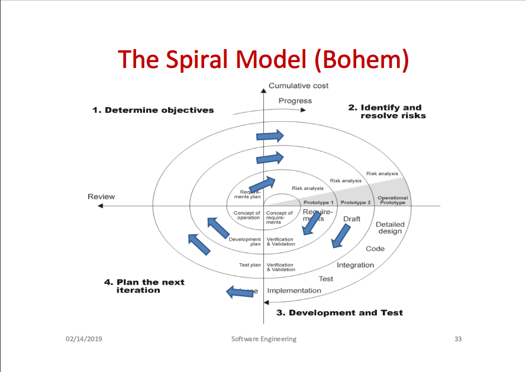
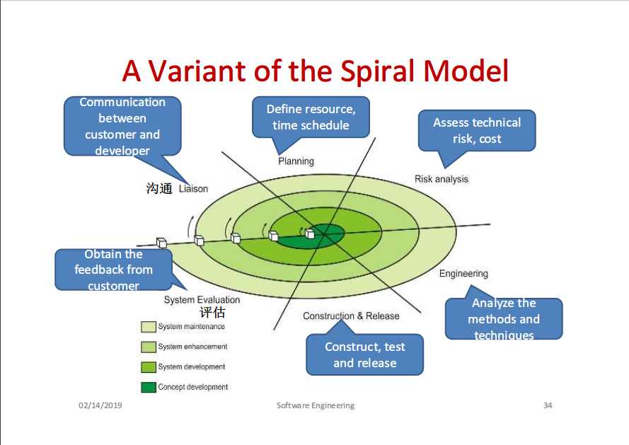

# What Is Software Engineering?

## What Is Software

- Software is
  - Instructions
  - Data structures
  - Documents

Software is computer programs and associated documentation. (**Software = Programs + Documentation**)

- Software has no mass (?)
- Software does not "wear out", but it does "deteriorate"(衰退)

Types of software:

- Generic software
  - System software
  - ...
- Customized software
  - Real-time software
  - Business software
  - Embedded software
  - ...

### Software Development History

(See also: _50 Years of Software Engineering_)

1. House software
  - Hardware was expensive, human resources are cheap
2. Product software
3. Distributed software
4. Network software
  - Hardware becomes cheap, network makes software distribution and reuse easier

## What Is Engineering

The **analysis, design, constructions, verifications, and management** of technical entities

## Software Engineering

Software Engineering is

- Sommerville:
  - an engineering **discipline** which is concerned with all aspects of software production
- IEEE 93':
  1. the application of a systematic, disciplined, quantifiable approach to the development, operation, and maintenance of software; that is, **the application of engineering to software**.
  2. the study of approaches as in 1.

        Software engineering -- Produces --> Software

### Purpose of Software Engineering

- Obtain high **quality** software
- Reduce development **cost**
- Meet the **deadline** of project

### Difference Between SE and CS

- Computer Science
  - Theories
  - Fundamentals
- Software Engineering
  - Practical problems

### SE Practices

- Requirement **analysis**
- Software **design**
- Software **programming**
- Software **verification** and **validation**
- Software **maintenance**

## Players in a Project

- Project leaders
- Engineers
- Customers

## Software Development Life Cycle

1. Requirement definition (specification)
  - understand and define **services**
  - identify **constraints**
2. Design and implementation
  - **convert** specifications to executable systems
3. Verification and validation (V&V testing)
  - (**verification**) check if a system **conforms to its specification**...
  - (**validation**) ... and **meets the customer's expectation**
4. Evolution
  - meet required **changes** from customers
  - and **bug corrections**

## Software Process and Process Model

- A **software process** is a set of activities, whose goal is the **development** or **evolution** of software
- A **software process model** is a **simplified representation** of a _software process_ from a specific perspective

### Process Models

- Waterfall
- Incremental
- Prototype
- Spiral
- Formal methods
  - Vienna Development Method (VDM)
  - The B method
  - _seldom used_

#### The Waterfall Model

1. Analysis
  - _produces_ software specs
2. Design
  - _produces_ software arch
3. Coding
  - _produces_ source code
4. Test
  - _produces_ test reports
5. Maintenance
  - _produces_ maintenance records

Advantages:

- Straightforward
- Disciplined

Arguments:

- Users cannot describe requirements clearly at the beginning
- Hard to follow
- Projects using this model are often delayed

#### Incremental Development

- Clients do **not** need to specify requirements for _the whole system_ at the beginning
  - Instead, specify _most important parts_
- A number of increments are defined

Process:

1. **Define** outline requirement
2. **Assign** requirements to _increments_
3. **Design** system architecture
4. **Develop** system _increment_
5. **Validate** _increment_
6. **Integrate** _increment_
7. **Validate** system
8. `goto 4.`

Advantages:

- Risk of failure is lower (compared to waterfall)
- Shorten delivery time

Disadvantages:

- System structure is _loose_
- Hard to define _increments_

#### The Prototyping Model

1. Quick design
2. Identify software requirements
3. `goto 1.` -> refined prototypes

Advantages:

- Users can see initial look of a system
- Developers can have a quick design
- Prototypes can be developed further into a system

Arguments:

- Rushed
- Hard to ensure quality and to maintain

#### The Spiral Model

An iterative software process model comining both _waterfall_ and _prototyping_.

Advantages:

- Developers can use prototyping in _each_ evolution level
- Reducing risks

Arguments:

- Continual risk analysis
- Documents maintenance
