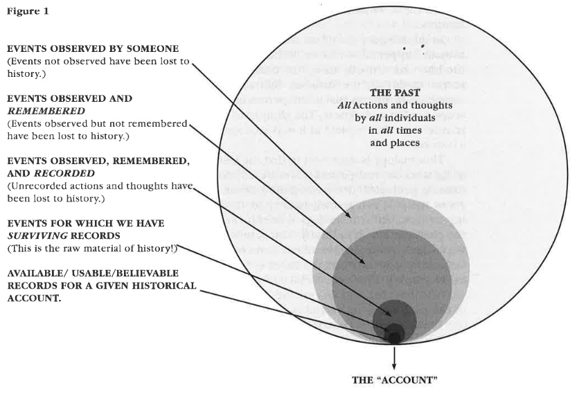

# The Nature of History

- History != What happened in the past
- History != The act of selecting, analyzing, and writings about the past

## History of the World

- Prehistory
- Ancient / Classical
- Medieval / Middle Age
- Early Modern
- Modern
- Contemporary

## What is History?

- General definition
  - _Human history_
  - **History** encompasses all actions and thoughts by all **individuals** in all times and places on this planet.
  - **History is the sum of total of everything that has actually happened _in the past_.**
  - **History is the accounts of the past written by histroians _based on the surviving records_.**

## What are Surviving Records?

- aka **"Primary Sources"**
  - _Materials / remains / testimonies (见证)_ produced by people or groups directly involved in the event or topic under consideration, either as priticipants or as witnesses

Surviving records provide evidence upon which historians rely in order to analyze and interpret the past.

## The Past Is Not The Same As History

- History **requires _evidence_**
- Not only a description of what had happened, but also an attempt to understand it

## "Father of History"

**Herodotus** (ca. 480 BCE - 429 BCE)

- Ancient Greek scholar born and lived in Caria
- The first person who conducted _historia_ through:
  - Eyewitness accounts
  - Verifiable information
  - Official records
- The peron who determined _the Nature of History_

## "Father of Chinese History"

**Sima Qian (司馬遷)** (ca. 186 BCE - 145 BCE)

- Grand scholar who lived in the **Han** dynasty
- Shiji (史記) "Records of the Grand Historian"
  - A clear overveiw of the history of China covering from the "Mystic Period of Five Emperors" to his time

## What Historians Do?

- Construct histrorical narratives by finding **cause-and-effect relationships** of the past events
- Using the **surviving records**

### Why they do so?

- ...

## The Functions of History (Why we study it?)

1. History provides a standpoint for understanding
2. History develops knowledge (gives us direction)
3. History reduces the possibility of repeating the same mistake
