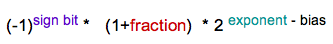
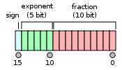

# Lecture 2: Bits: Data Representation and Manipulation

_"All things are numbers." -- Pythagoras_

## Bits

- Binary digITs
- 1 Byte = 8 bits
- A word is a fixed-sized piece of data handled as a unit

## Numeric Data Representation

- Unsigned integers
- Signed integers
  - Sign-magnitude
  - 1's complement
  - 2's complement
- Real number representation
- Floating-point numbers

## Floating-point Numbers

### Half Precision

- Single Precision: 32-bits, 1 for sign, 8 for exponent, 23 for fraction (mantissa)

## Non-numeric Data Representation

- ASCII Code: 7 bits representing 128 characters <!-- hmm, how about extended? -->
- Universal Character Set (UCS): 16 bits, have backward compatibility to ASCII code <!-- Unicode -->
- Digital Audio:
  - Analog -- _sampling_ (ADC) --> Digital
  - Digital -- DAC --> Analog -- _amplified_ --> Sound
- Image & Video: **RGB**

## Operations on Bits

- Binary Arithmetic Operations
  - Addition
  - Subtraction
  - (Overflow)
- Boolean Logic Operations (Bitwise)
  - AND
  - OR
  - NOT
  - XOR

### Overflow

Overflow occurs when a calculation produces a result that is greater in magnitude than what a given register or storage location can store or represent.
