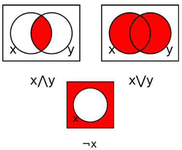
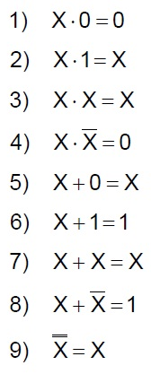
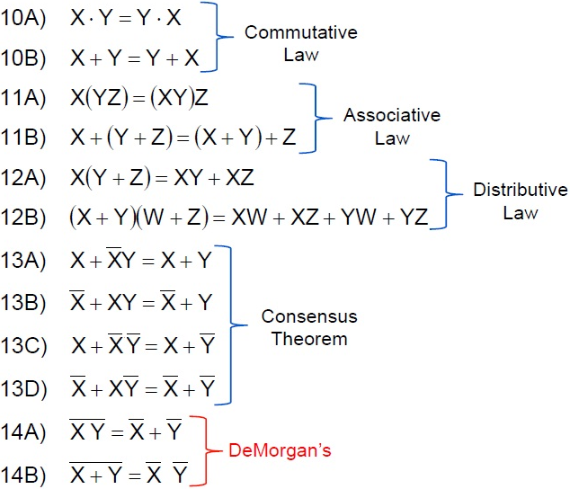

# Lecture 3: Boolean Algebra

(Algebra of Logic) A two-valued system of algebra that represents logical relationships and operations.

## Boolean Variables & Operations

Boolean variables are variables that can take only two values:

- **True (1)**
- **False (0)**

Boolean Operators:

- **AND**
- **OR**
- **NOT**

## Truth Table

### AND

| A | B | A · B |
| - | - | ----- |
| 0 | 0 |   0   |
| 0 | 1 |   0   |
| 1 | 0 |   0   |
| 1 | 1 | **1** |

### OR

| A | B | A + B |
| - | - | ----- |
| 0 | 0 | **0** |
| 0 | 1 |   1   |
| 1 | 0 |   1   |
| 1 | 1 |   1   |

### NOT

| A | A' |
| - | -- |
| 0 | 1  |
| 1 | 0  |

## Boolean Functions

- A **function** is a relation that uniquely associates members of one set with members of another set
- A Boolean function has:
  - At least one Boolean variable
  - At least one Boolean operator
  - At least one input from the set {0,1}
- It produces an output that is also a member of the set {0,1}

## **Precedence** of Boolean Operators

1. **NOT**
2. AND
3. OR

## Boolean Identities (布尔等价律)

- [_Consensus Theorem_: 共识定律](https://en.wikipedia.org/wiki/Consensus_theorem)
- [_De Morgan's Law_: 德摩根定律](https://en.wikipedia.org/wiki/De_Morgan%27s_laws)

## Complements

_De Morgan's Law_ provides an easy way of finding the complement of a Boolean function.

## Canonical Forms

- Logically equivalent expressions have identical truth tables. For example, **(X+Y)' = X'Y'**
- In order to eliminate confusion, designers express Boolean functions in standardized or canonical form
- There are two canonical forms
  - **Sum-of-Products**
  - **Product-of-Sums**

### Sum-of-Products

- aka. **Disjunctive Normal Form (DNF, 析取范式)**

### Product-of-Sums

- aka. **Conjunctive Normal Form (CND, 合取范式)**
