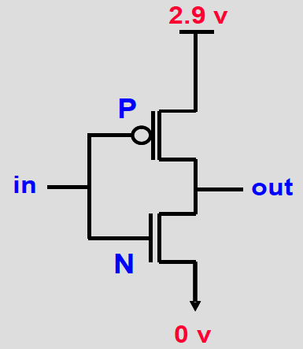
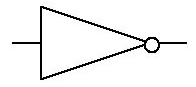
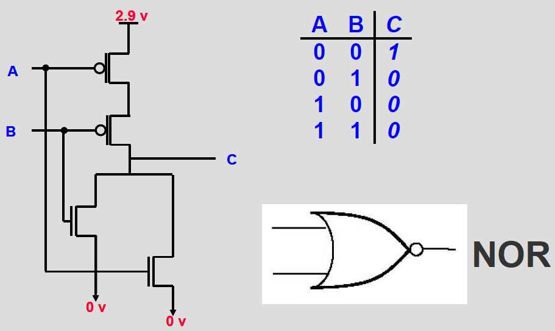
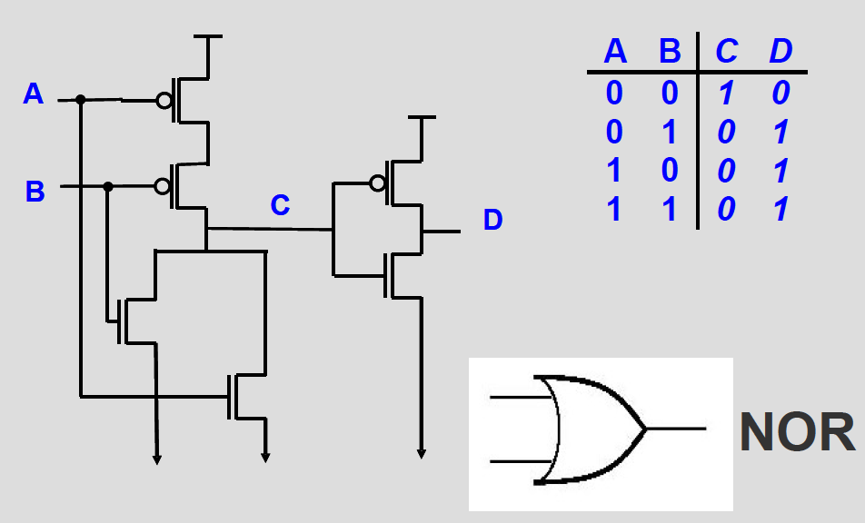
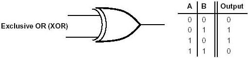

# Lecture 4: From Transistors to Gates

## Transistor: Electricity Flow

- **Conducts** when V_{GS} is high (N Type transistor)
- **Blocks** when V_{GS} is 0

## CMOS Transistors

- **Complementary Metal-Oxide Semiconductor**
- Two types: **P-type** (positive) and **N-type** (negative)
  - **P**:
    - Insults when Gate = 1
    - _Conducts when Gate = 0_
  - **N**:
    - _Insults when Gate = 0_
    - Conducts when Gate = 1
  - P and N-type transistors operate in inverse modes

## Logic Gates

### **NOT**: Inverter

- **In = 0**
  - N Insults
  - P Conducts
- **Out = 1**

### **AND / NAND**

- **A = 0, B = 0**
  - N1, N2 Insults
  - P1, P2 Conducts
  - **C = 1**
    - P3 Insults
    - N3 Conducts
      - **D = 0**

### **NOR**

- **A = 0, B = 0**
  - P1, P2 Conducts
  - N1 (Left) Insults, N2 (Right) Insults
  - **C = 1**

### **OR**

### **XOR**

