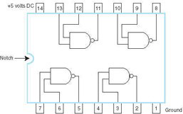
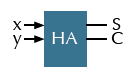
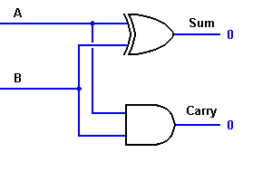
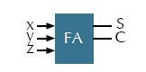
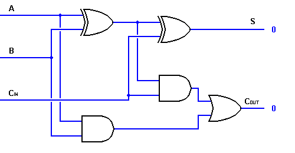
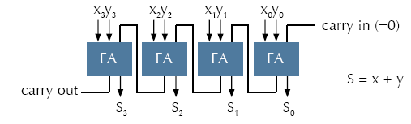

# Lecture 5: From Gates to Circuits I: Combinational Circuits

## Basic Building Blocks

- AND
- OR
- NOT
- NAND
- NOR
- XOR

## Universal Gate

**Any electronic circuit can be constructed using only _NAND_ gates.**

## Integrated Circuits (IC)

### Two Types of Circuits

- **Combinational logic circuits**
  - Its output depends solely on its current input.
  - _No storage, memoryless_
- **Sequential logic circuits**
  - Its output depends not only on its current input, but also on its _current state (previous input)_
  - _Can remember previous input, storage devices_

## Binary Addition

### Half Adder

- S = xor(x,y)
- C = and(x,y)

### Full Adder

z is **Carry-In**.

### Ripple-Carry Adder

**Very slow.**

## Decoder

- A decoder uses the inputs and their respective values to select one specific output line.
- All memory addresses in a computer are specified as binary numbers.
  - When a memory address is referenced (whether for reading or for writing), the computer first has to determine the actual address.

## Multiplexer

- A multiplexer behaves like a **channel selector**
- The particular input chosen for output is determined by the value of the multiplexer's control lines.
- To be able to select among n inputs, **log_2^n** control lines are needed

## Combination Circuit Synthesis
