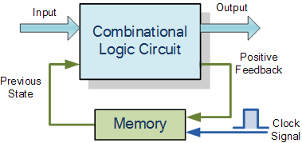
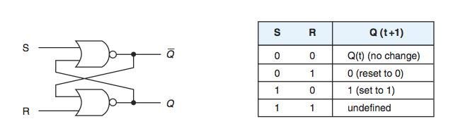
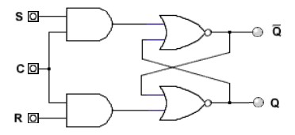
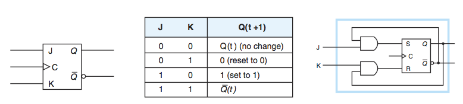
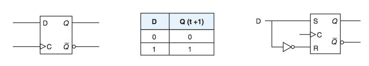

# Lecture 6: From Gates to Circuits II: Sequential Circuits

Sequential Circuits = Combinational Circuits + Memory

## SR NOR Latch (Flip-flop)（SR 锁存器（触发器））

## Gated SR Latch

**EN** = 使能线

## Glitch

- There is a finite time delay between a change in the inputs of a gate and any change in the output. This time is called **gate delay**.
- In order to avoid glitches, we want to design storage elements that only accept input when ordered to so
- We use a **clock** to be the control input that gives orders to the circuit about when to change states

## Clock

Inputs to the circuit can only affect the storage element at given, discrete instances of time

### Edge-Triggered（边缘触发）vs Level-Triggered（电平触发）

- **Edge-triggered**: allowed to change their states on either the rising or falling edge of the clock signal
- **Level-triggered**: allowed to change state whenever the clock signal is either high or low
- Technically, **a latch is level triggered**, whereas **a flip-flop is edge triggered**

## Clocked SR Latch

The latch can change only when C is true.

## JK Flip-Flop

The JK flip-flop is basically an SR flip flop with feedback which enables only one of its two input terminals, either SET or RESET to be active at any one time.

## D Flip-Flop

