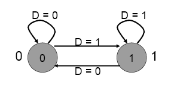

# Lecture 7: Finite State Machine

## The Concept of State

- The output of a sequential circuit is a function of the current input and the previous state
- The state is stored in the storage element
- The new state is also a function of the previous state and the current input

## Finite State Machine

A system is a finite state machine if it has the following five properties:

- A finite number of states
- A finite number of external inputs
- A finite number of external outputs
- An explicit specification of all allowed **state transitions**
- An explicit specification of the rules for each external output value

## State Diagram

- Each state is shown with a circle, labeled with the state value – the contents of the circle are the outputs
- An arc represents a transition to a different state, with the inputs indicated on the label

## Computer as a FSM
