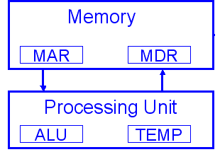
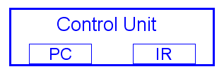
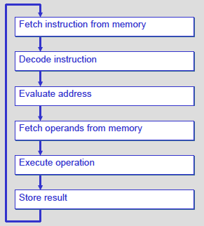
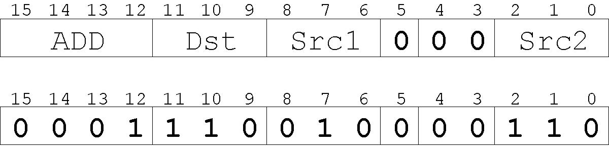
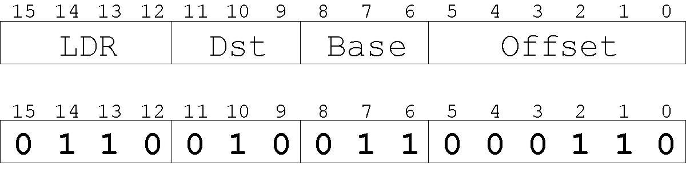
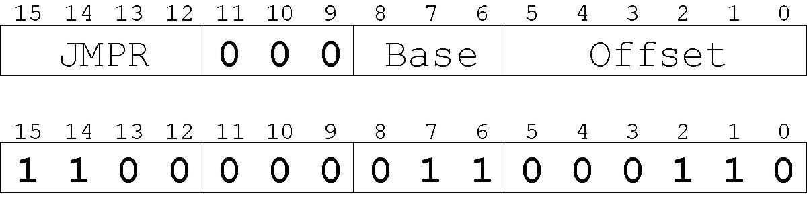

# Lecture 8: Microarchitecture

## ISA and Microarchitecture

- ISA is the interface of a processor as seen by an assembly language programmer or compiler writer
- Micro-architecture transfers the ISA into an implementation
- For a given ISA, there might be many different microarchitectures
- Architecture is a collection of circuits connected together

## Memory

### Word

Assume **byte addressable**.

## Interface to Memory

To read a location (A):
  1. Write the address (A) into the MAR.
  2. Send a “read” signal to the memory.
  3. Read the data from MDR.

To write a value (X) to a location (A):
  1. Write the data (X) to the MDR.
  2. Write the address (A) into the MAR.
  3. Send a “write” signal to the memory.

## Inside CPU

### Data path

- Registers
- ~~CPUs~~ ALUs

### Control Path

- IR (instruction register): the current instruction
- PC (program counter): address of the next instruction
- Control units are FSMs

## Input / Output

- Devices for getting data into and out of memory
- Each device has its own interface, usually a set of registers like the memory's MAR and MDR
  - keyboard: data register (KBDR) and status register (KBSR)
  - console: data register (CRTDR) and status register (CRTSR)

## Instruction

A computer's instructions and their formats is known as its Instruction Set Architecture (ISA).

- **opcode**: operation to be performed
- **operands**: data / locations to be used for operation

An instruction is encoded as a sequence of bits just like data, a control unit interprets instruction.

### Instruction Processing

## Driving Force: the Clock

At each clock "tick", control unit moves to the next machine cycle.

## The Little Computer 3 (LC-3)

### ADD

- **Add Src1 and Src2 to Dst**
- R6 = R6 + R2:

### LDR

- **Move [Base + Offset] to Dst**
- Load memory content at address (R3 + 6) to R2:

### JMPR

- Set **PC** to the value obtained by adding an offset to a register.
- PC = R3 + 6:

