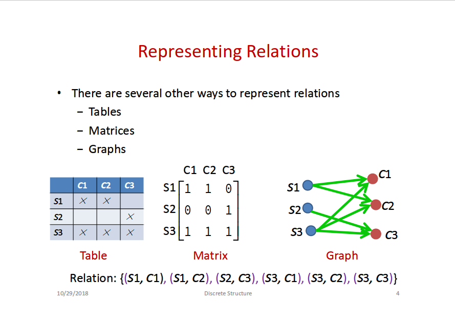

# Lecture 10: Relations

## Representing Relations

- Tables
- Matrices
- Graphs

## Binary Relations

- A binary relation from set `A` to set `B` is **a subset of `A X B`** (`X = \times`)
- `R` is a set of **ordered pairs** in the form `(a, b)` where `a ∈ A` and `b ∈ B`
- `a R b` (denotes `(a, b) ∈ R`) is called **`a` related to `b` by R**

## Functions and Relations

- Functions are **specialization (特化)** of relations
- Relations are **generalization (泛化)** of functions

## Properties of Relations

- **Reflexive (自反)**
  - `(a, a) ∈ R` for all `a ∈ A`
- **Symmetric**
  - `(a, b) ∈ R && (b, a) ∈ R` for all `a, b ∈ A`
- **Anti-Symmetric**
  - `(a, b) ∈ R && (b, a) ∈ R -> a = b` for all `a, b ∈ A`
- **Transitive (传递)**
  - `(a, b) ∈ R && (b, c) ∈ R -> (a, c) ∈ R` for all `a, b, c ∈ A`

### Equavalence Relations

A relation `R` on a set `A` is called an **equivalence relation (等价关系)** if it is:

- Refiexive,
- Symmetric, and
- Transitive.

If `(a, b) ∈ R`, then `a` and `b` are said to be **equivalent through `R`** (`a R b`)

- The _set_ of elements related to an element `a` through `R` is called **equivalent class** of `a` (`[a]_R` or `[a]`)
  - Any element in an equivalent class is called a **representative** of the class

#### Partition

- If equivalent classes of set `A` form `A` again by unioning them togehter, they are **partition(s)** of `A`
  - And they **partition** `A`

**Theorem.** Let `R` be an equivalence relation on set `A`, the following statements are equivalent:

- `a R b`
- `[a] = [b]`
- `[a] ∩ [b] ≠ ∅`

Proof on slide 10.41.

## Combining Relations

- aka composite of relations
- **Denoted `R ◦ S`** for `(a, b) ∈ R` and `(b, c) ∈ R`

### Power of Relations

- `R^1` = `R`
- `R^n` = `R^{n - 1} ◦ R`

**Theorem.** The relation `R` on a set `A` is _transitive_ **if and only if** `R^n ⊆ R` for `n = 1, 2, 3, ...`

## N-ary Relations

- **Domain**: `A1 × A2 × ... × An`
- **Degree**: `n`

### Operations on N-ary Relations

- **Selection**: map _n-ary relation `R`_ to _n-ary relation `T`_, where all elements in `T` satisfies _condition `C`_.
- **Projection**: map _n-tuple_ to _m-tuple_ (m < n)
