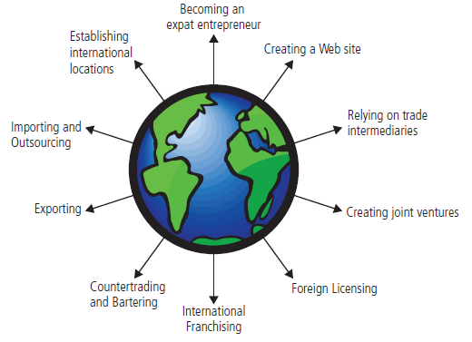

# Chapter 15 Global Aspects of Entrepreneurship

## Ten Strategies for Going Global

- [Create a presence on the Web](#the-webs-global-search)
- Rely on trade intermediaries
- Form joint ventures
- **Engage in foreign licensing**
- **Consider international franchising**
- Use countertrading and bartering
- Export
- Establish international locations
- Use importing and outsourcing
- Become an expat entrepreneur

### The Web's Global Search

- It’s important to “think local” when creating Web sites to target customers in other countries.
  - _e.g. Providing both Chinese and English version of a website._

### Trade Intermediaries

- **Trade intermediaries（贸易中介）:**
  - Domestic agencies that serve as distributors in foreign countries for companies of all sizes.
  - Make the transition to world markets faster and easier for small businesses, but it is important to select an intermediary carefully.

### Joint Ventures

- **Domestic joint venture:**
  - Two or more U.S. companies form an alliance for the purpose of exporting their goods and services abroad.
- **Foreign joint venture:**
  - A domestic firm forms an alliance with a company in the target nation.

Most important ingredient for success is to choose the right partner.

### International Licensing

- A relatively simple way for even the most inexperienced business owner to extend his reach into foreign markets.
  - _Enter markets quickly and easily with virtually no capital investment._
- Ideal for companies whose value lies in its **intellectual property**.
- **Minimize risk** by ensuring that proper patents, trademarks, and copyrights are in place.

### International Franchising

Steps:
1. Identify the country or countries that are best suited to the franchiser’s business concept.
2. Generate leads for potential franchisees.
3. Select quality candidates.
4. Structure the franchise deal.
  - Direct franchising - _single unit_
  - Area development - _multiple units_
  - Master franchising - _rights to franchise_

### Countertrade and Barter

- **Countertrade（对等贸易？）:**
  - A transaction in which a company selling goods in a foreign country agrees to promote investment and trade in that country.
- **Barter（易货贸易；物物交换）:**
  - The exchange of goods and services for other goods and services.

### Exporting

- Increased sales and profits.
- More diversified customer base.

### Establish International Locations

- Lower start-up costs.
- Lower labor costs.
- A better understanding of local customer preferences.
- A better understanding of local business practices.

### Steps to Successful Importing or Outsourcing

- ...
- Protect your company’s intellectual property.
- Provide an exact model of the product you want manufactured.
- Stay in constant contact with the manufacturer and try to build a long-term relationship.

### Expat Entrepreneurs

- **Expat entrepreneurs:**
  - Keep their citizenship in their home country but live and run their businesses on foreign soil.

## Barriers to International Trade

- Domestic Barriers
  - Attitude: “My company is too small to export.”
  - Lack of information about how to get started.
  - Inability to obtain adequate financing.
- International Barriers
  - Tariffs:
    - A tax a government imposes on goods and services imported into that country.
  - Nontariff barriers:
    - Governments that protect domestic industries.
- Quotas:
  - Limits on the amount of a product imported into a country.
- Embargo:
  - Total ban on imports of certain products.
- Dumping:
  - Selling large quantities of a product in a foreign country below cost to gain market share.
- Political barriers:
  - Rules, regulations and political risks.
- Business barriers:
  - Different _cost structures and business practices._
- Cultural barriers:
  - Differing _languages, philosophies, traditions, and accepted practices._

## Guidelines for Success in International Markers

- ...
- **"Glocalize"**: make global decisions about products, markets, and management and allow local employees to make tactical decisions.
