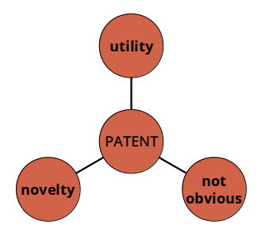

# Patent

## Key Concepts

- Invention
- Inventive step
- Novelty
- Obviousness (triviality)
- State-of-the-art
- Prior concept
- Prior user (existing user)
- Prior (common general) knowledge

## Patentability Road Map

1. Invention?
2. Novelty?
3. Trival?
4. Industrial application?
5. Patent.

## Invention and Inventive Steps

S.96: An invention involves _inventive steps_ if it is **not trival** to a person skilled in the art, having regard to any matter which forms part of the state of art.

- Invention: result of a creative idea
- Step: noticeable
- Inventive step: a clearly identifiable difference between the state of art and the claimed invention

## The _Windsurfing_ Test

Test whether the alleged invention was obvious (trival) as to be answered objectively by reference to whether, at the material time (immediately, prior to the priority date), the alleged inventive step or concept would have been obvious (trival) to a skilled addressee.

1. Identify the notional **"person skilled in the art"**.
    - _Mills & Rockley (Electronics) Ltd v. Telegraph Printed Circuits Ltd_: "... [person skilled in the art] is **a skilled technician** who is **well acquainted with workshop technique and who has carefully read the relevant literature**. He is supposed to have an unlimited capacity to assimilate(digest) the contents of... score of specifications but to be incapable scintilla(some) of invention. When dealing with obviousness, unlike novelty, it is **permissible to make a "mosaic" out of the relevant documents**, but it must be a mosaic which can be put together by an unimaginative man with no inventive capacity."
2. Identify the relevant **common general knowledge** of that person.
    - individual patent specifications
    - widely read publications
3. Identify the **inventive concept** of the claim in question or if that cannot readily be done, construed it.
4. Identify what, if any, **differences exist between the "state of the art" and the inventive concept** of the claim.
    - _state of the art_: S.94(2): **everything available to the public, regardless of region**
5. Viewed without any knowledge of the alleged invention as claimed, do those differences constitute steps which would have been **obvious (trival) to the person skilled in the art** or do they require any degree of invention?

## Anticipation

If the invention is "anticipated", it will be deprived of novelty (it will not be novel); it means someone else has thought of it, and it is in the public domain. It is a question of fact

There are 2 types of anticipation:

1. Anticipation **by use**
2. Anticipation **by disclosure**

There are 2 elements of anticipation:

1. Prior disclosure
2. Enablement (**revealing how the invention works**)

## Obviousness

Obviousness: "... so obvious that it would at once occur to anyone acquainted with the subject"

_State of the art_ consists of:

1. The **idea**
2. The **prejudice** that _it would work or be impractical_
    - Showing that _"lions in the path"_ are _"paper tigers"_

## Industrial Appliacation

S.97: The invention must be susceptible of indistrial application.

See: _Eli Lily & Co v. Human Genome Sciences Inc_

- The notion of industrial application must be construed (explained) broadly, including all manufacturing, extracting, and processing activities of enterprises that are carried out continuously, independently, and for commercial gain.
- **Non-profit**
- Capability of _industrial application_ must be **derivable** by a skilled person from the description and the _common general knowledge_
- ...

## Inventor

The right to a patent shall belong to the **inventor** or his successor in title.

See _University of Southampton's Application_:

- It's necessary to identify the **inventive concept or concepts** in the patent or application.
- It's necessary to identify **who came up with the inventive concept or concepts**. He or they were the inventors.
- A person was not an inventor merely because he "contributed to a claim". Contribution had to be the formulation of the inventive concept.

## Infringement

Infringement of a patent shall result in:

- Injunction restraining defendent from any act of infringement
- An order requiring defendent to deliver up or destroy any patented product in relation to which the patent is infringed
- Award of damages
- Account for profit, against the infringer

## Defence

**Innocense**: If, at the date of infringement, the infringer is not aware of the existence of patent, the infringer is innocense.

## Exceptions

- A **discovery, scientific theory or mathematical method**
- An **aesthetic creation**
- A scheme, rule or method for performing a mental act, playing a game or doing business, or a _program of computer (?)_
- The **presentation of information**

## Proper Approach to Patent Registration

1. Take care of the **number of invention** is involved in a single registration (it should be 1 per registration)
2. Identify **alleged (faked) inventions** (that actually exist before; _trival_)
3. Identify **collocation of (combined) inventions** (that are actually a combinition of several prior inventions)
  - _SABAF SPA v. MFI Furniture Centres Ltd_
  - if the collocation of invention **_together_ produces new or improved result**, it is patentable!

## Correct Approach to Patent Specification

- Literal approach (the _"pith and marrow"_ approach, old)
- Purposive approach
- Specification: document in which the **invention is described**, and the **claim of the patentee is stated**
