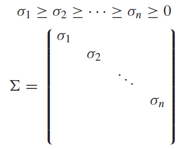

# Chapter 6: Eigenvalues and Eigenvectors

## 6.3 Diagonalization

### Theorem

### Diagonalization

=> 

### Notations

- Diagonal Matrix: 
- P:  (where **x** are eigenvectors respectively)

### Orthogonally Diagonalizable

## 6.5 The Singular Value Decomposition

### Motivation

- Compute `rank()` without Gauss-Jordan Elimination (not practical in finite-precision arithmetic)

### The Singular Value Decomposition

- Assume that **A** is an m × n matrix with m ≥ n.
- Factorize **A** into a product where **U** is an _m × m_ orthogonal matrix, **V** is an _n × n_ orthogonal matrix, and **E (_Sigma_)** is an _m × n_ matrix whose off-diagonal entries are all 0s and whose diagonal elements satisfy:

where _delta\_i_ are unique.

### Theorem

If **A** is an m × n matrix, then **A** has a singular value decomposition.
