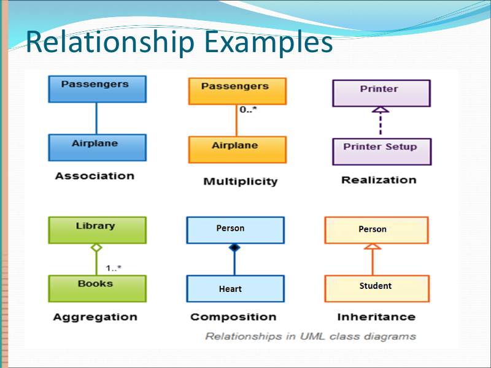

# Object - Oriented Development

## Relationships Between Classes

- Association (关联)
  - Unidirectional
  - Bidirectional
  - Multiplicity: \* to \* relationship
- Aggregation
  - _Different lifetime_
- Composition
  - _Lifetime is dependent_
- Inheritance
- Polymorphism
  - Execute dicision at **runtime**

## Object Oriented Design

Given a program:

1. **Class** needed?
2. **Fields, methods** needed in Classes?
3. **Relationships** between Classes?
