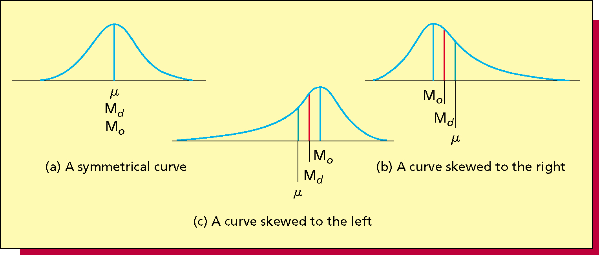
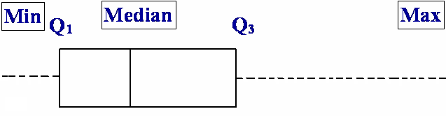

# 2017-02-17 Chapter 3: Descriptive Statistics: Numerical Methods

## 3.1 Describing Central Tendency

- **Mean**(![Mean][]): The average or expected value
- **Median**(![Median][]): The value of the middle point of the ordered measurements
- **Mode**(![Mode][]): The most frequent value

[Mean]:   https://latex.codecogs.com/svg.latex?\mu
[Median]: https://latex.codecogs.com/svg.latex?M_d
[Mode]:   https://latex.codecogs.com/svg.latex?M_o

### Mean

#### Population Mean


#### Sample Mean（样本均值）

**The value to expect, on average and in the long run.**

For a **sample** of size _n_, the **sample mean** is defined as:


### Median

### Mode（众数）

### Relationships Among Mean, Median and Mode



## 3.2 Measures of Variation（变异数）

### The Variance

#### Population Variance（总体方差）

#### Sample Variance

#### The Standard Devitation（标准差）

#### `z` Scores

**`z`** = (x - mean) / standard deviation

The z score is the number of standard deviations that x is from the mean
- A positive z score is for x above (greater than) the mean
- A negative z score is for x below (less than) the mean

### Coefficient of Variation（变异系数）

Measures the size of the standard deviation relative to the size of the mean

Coefficient of Variation = (standard deviation / mean) × 100

- Compare the relative variabilities of values about the mean
- Compare the relative variabilities of populations or samples with different means and different standard deviations
- Measure risk

## 3.3 Percentiles, Quartiles（四分之一分位点） and Box-and-Whiskers Display

### Percentiles

For a set of measurements arranged in increasing order, the pth percentile（百分位点） is a value such that
`p` percent of the measurements fall at or below the value and `(100-p)` percent of the measurements fall at or above the value

```
  |----|----|----|----|
  ^    ^    ^    ^    ^
  0%   25%  50%  75%  100%
       Q1   Md   Q3
```

- The first quartile `Q1` is the 25th percentile
- The second quartile (or median) `Md` is the 50th percentile
- The third quartile `Q3` is the 75th percentile
- The interquartile range **IQR**（四分位距） is `Q3 - Q1`

#### Calculating `p`th Percentile

1. Arrange
2. Calculate index 
3. Is `i` integer?
  - **Y**: `p`th percentile is the **average** of the `i` and the `i+1`
  - **N**: `p`th percentile is the `i`

### The Box-and-Whiskers Display（盒型图）



The **box** plots the:

- First quartile, `Q1`
- Median, `Md`
- Third quartile, `Q3`

**Limits**, located `1.5 * IQR` away from the quartiles:
- Lower limit = `Q1 – (1.5 * IQR)`
- Upper limit = `Q3 + (1.5 * IQR)`

The **whiskers**: 2 dashed lines

- A _dashed line_ drawn from the box below `Q1` down to the smallest measurement between the lower and upper limits
- Another dashed line drawn from the box above `Q3` up to the largest measurement between the lower and upper limits

#### Outliers（异常值）

- Outliers are measurements that are very different from most of the other measurements
- Plot each outlier using the symbol `*`.

## 3.4 Weighted Means（加权均值）


