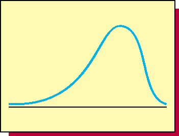
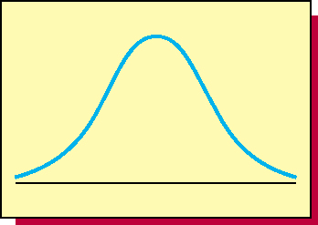
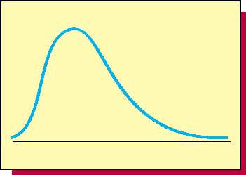
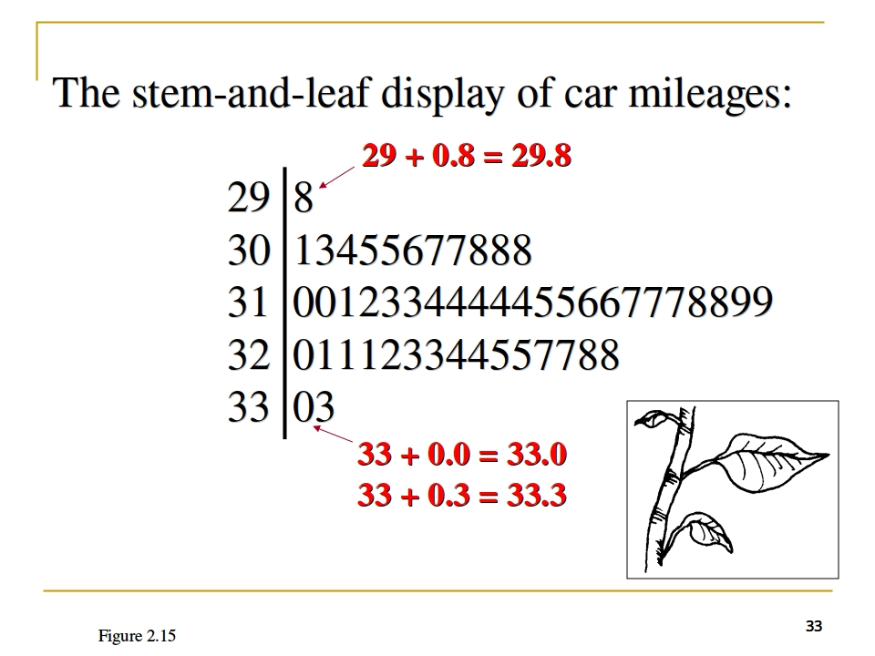
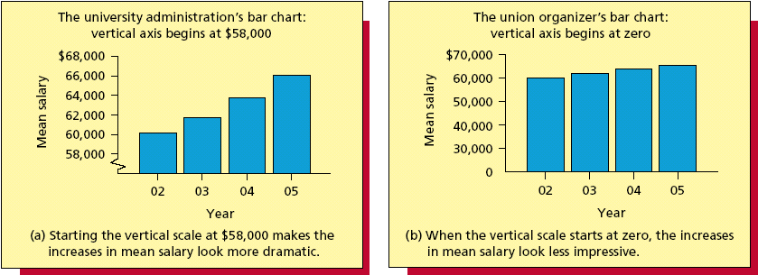
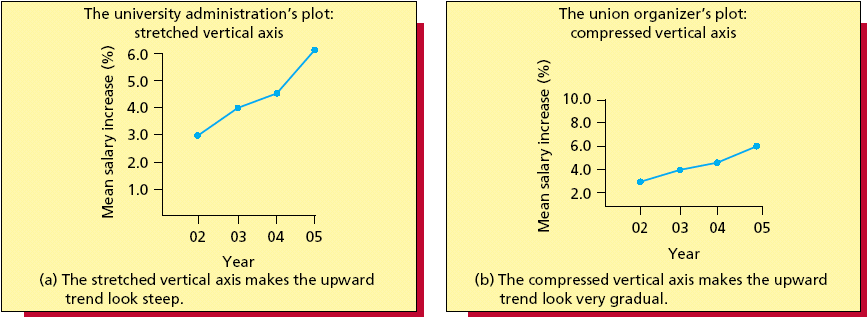

# 2017-02-17 Chapter 2: Descriptive Statistics: Tabular and Graphical Methods

## 2.1 Graphically Summarizing Qualitative（定性） Data

### Relative Frequency and Percent

| Frequency | Relative Frequency |
| :-------- | :----------------- |
| 频数       | 频率               |

If the data set consists of _n_ obervations,

Relative frequency = (frequency) / (_n_)

### Bar Charts and Pie Charts

- **Bar chart**: A **vertical or horizontal rectangle** represents the frequency for each category
  - Height can be frequency, relative frequency, or percent frequency
- **Pie chart**: A **circle divided into slices** where the size of each slice represents its relative frequency or percent frequency

## 2.2 Graphically Summarizing Quantitative（定性） Data

### Frequency Distribution

#### Constructing the frequency distribution

Steps in making a frequency distribution:

1. Determine the number of classes **K**
  - **K** is the smallest whole number for which 
2. Determine the class length **L**
  - Class length **L** is the step size from one to the next
  - _**L** = (Largest value - Smallest value) / **K**_
  - **Arbitrarily round the class length up** to 3 days/class
3. Form non-overlapping classes of equal width
4. Tally and count the number of measurements in each class
5. Graph the histogram

#### Relative Frequency Histogram

Percentages without "%".

#### Remarks

- The procedure introduced is _not the only way_ to construct a histogram.
- Sometimes it is desirable to let the nature of the problem determine the histogram classes.
- Sometimes histogram with _unequal_ class lengths is better.  e.g. open-ended classes

### Some Common Distribution Shapes (Skewness 偏度)

- Left Skewed

- Symmetric

- Right Skewed

## 2.3 Stem-and-Leaf Displays

- Purpose is to see the overall pattern of the data, by grouping the data into classes
- Best for small to moderately sized data distributions

### Splitting The Stems

There are no rules that dictate the number of stem values, so we can split the stems as needed.

### Constructing a Stem-and-Leaf Display

- **Stem Unit**
- **Leaf Unit**

### Back-to-Back Stem-and-Leaf Display

We can construct a Back-to-Back Stem-and-Leaf Display if we wish to **compare** two distributions.

## 2.4 Contingency Tables（列联表）

(Omitted)

## 2.5 Misleading Graphs and Charts

### Scale Break

### Scale Effects

